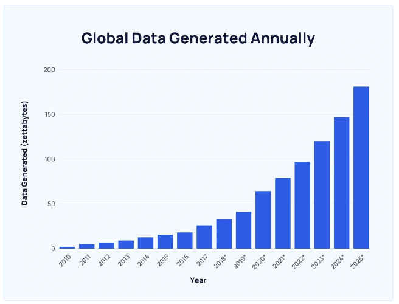
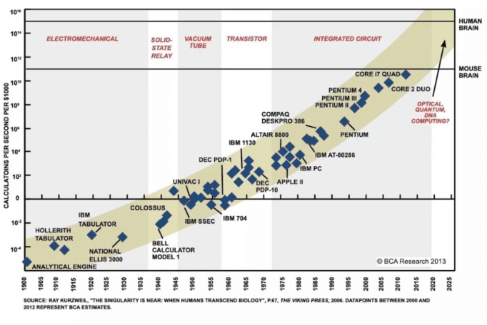
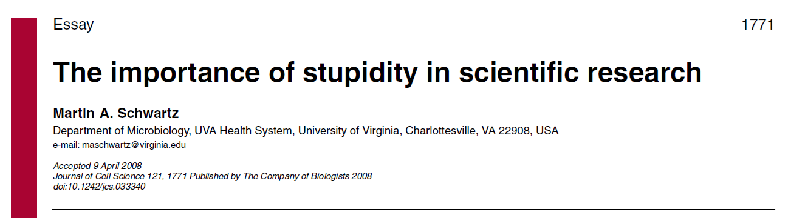
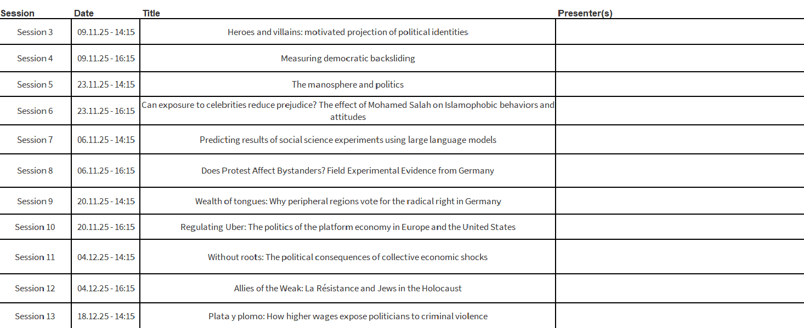
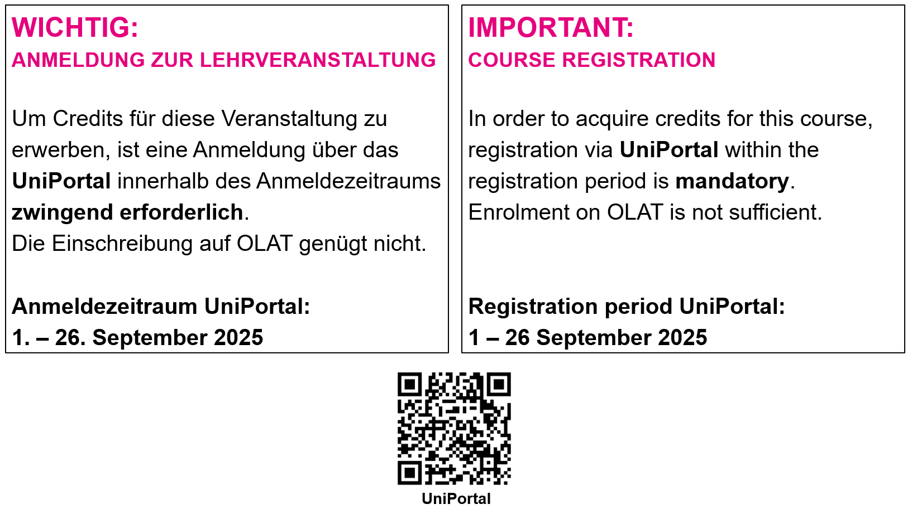

# Introduction

## About me

<div style="font-size:90%">

-   Postdoctoral researcher at the project [DIGIPOL](https://www.unilu.ch/en/faculties/faculty-of-humanities-and-social-sciences/institutes-departements-and-research-centres/department-of-political-science/research/digitalization-and-political-conflict-parties-voters-and-electoral-alignment-digipol/#section=c122045) and the Chair of Political Behaviour and Communication

-   PhD in Political and Social Sciences from the [EUI](https://www.eui.eu/en/home)

-   Interested in **political behaviour**, **comparative politics**, **democratic attitudes and preferences**, **quantitative methods**

-   Originally from the [city with the most UNESCO heritage sites in the world](https://www.architecturaldigest.com/story/cordoba-spain-has-most-unesco-world-heritage-sites)

-   You can find more information about me in [my personal website](https://acanalejo.github.io/)

</div>

## What about you?

-   Name

-   Background

-  Why did you take the course?

-  What do you expect from this course?


# What is this course about?

## An era of data and computation

{fig-align="center"}

<center>[Source here](https://explodingtopics.com/blog/data-generated-per-day)</center>

## An era of data and computation

{fig-align="center"}

<center>[Source here](https://www.researchgate.net/figure/The-exponential-progress-of-computing-power-from-1900-to-2013-with-projections-into_fig1_335422453)</center>

## Is it enough with collecting data and having the power to analyze it?

. . .

<br>

**No! Science is all about** [**design**]{style="color:red;"}**!**

. . .

- The goal is to make **inferences** about the world on the basis of empirical information

- To make the right inferences, **methods and rules** are crucial

- This course is about these rules and methods, and how to **apply** them, with a focus on **quantitative research**

## In what topics are you interested?

{fig-align="center"}

---

<br>

{fig-align="center"}

## Learning outcomes

1. ...understand the logic of quantitative social science.

2.  ...understand and critically assess quantitative research articles.

3. ...identify an appropriate and feasible research design for a given research problem.

4. ...communicate complex concepts effectively to a broad audience.

5. ...perform simple descriptive and inferential statistical analyses.

# The course organization

## Teaching policy

<br>

This is a **seminar**, not a lecture!

<br>

Therefore, ***active participation*** is the most important tool:

- No or only minimal slides

- Basic readings must be read **in advance**

- **Seminar questions** every week

- At least one **presentation** by student

## Integration and interaction policy

<br>

- No discrimination

- Inclusive language

- No bullying

- **Everyone** should participate in equal terms

## Artificial intelligence (AI) policy

<br>

- AI tools, like ChatGPT, are allowed

- They should augment, not replace, human work

- Mandatory declaration policy

## Evaluation I

1. Attend all the sessions 

2. Read the mandatory readings before each session 

    - Study the basic reading

3. Participate actively

4. Answer the seminar questions of each session 

    - Specific folder in OLAT
    
    - To be uploaded the day before the class (but not graded!)

## Evaluation II


<div style="font-size:90%">


5. Presentation of the applied readings
    
    - More guidelines later

    - Organization at the end of this class

6. Complete three take-home exercises

    - Second half of the course
    
    - Empirical applications with R
    
    - Two different tracks (beginner and advanced, more on this later)
    
</div>
    
## 

```{r echo=FALSE, fig.width=6, fig.height=3, fig.align = "center"}
# Load necessary library
library(ggplot2)

# Data for grading policy
grades <- data.frame(
  Category = c("Seminar Questions", "Class Participation", "Take-home Exercises", "Presentation"),
  Percentage = c(10, 20, 30, 40)
)

# Reorder the levels of Category based on Percentage from higher to lower
grades$Category <- factor(grades$Category, levels = grades$Category[order(-grades$Percentage)])

# Create a bar chart
ggplot(grades, aes(x = reorder(Category, -Percentage), y = Percentage, fill = Category)) +
  geom_bar(stat = "identity") +
  geom_text(aes(label = paste0(Percentage, "%")), vjust = -0.5) +  # Add percentage labels
  theme_minimal() +
  labs(title = "Grading Policy Breakdown", x = "Category", y = "Percentage") +  # Remove x-axis label
  scale_fill_brewer(palette = "Set2") +
  ylim(0,50) +
  theme(legend.position = "right",  # Add legend for categories
        legend.title = element_blank(),  # Remove legend title
        axis.text.x = element_blank(),  # Remove x-axis text
        plot.title = element_text(hjust = 0.5))  # Center title
```

## Masterseminar paper

<div style="font-size:90%">

- Between 7000 and 9000 words

- Topic to be agreed with the lecturer

- Paper outline of by **December 1st 2025**

    -	Research question

    - Academic and societal relevance

    -	Theory and hypotheses

    -	Approach and structure of the paper

- Submission deadline in Spring, but flexible

</div>

## Office hours

<br>

No **office hours**! 

<br>

Send an email to the lecturer ([alvaro.canalejo@unilu.ch](alvaro.canalejo@unilu.ch)) to schedule a meeting one week in advance (**Office 3.B14**)

## Resources (OLAT)

<div style="font-size:60%">

- **AJ**: Angrist, J. D. (2014). Mastering' metrics: The path from cause to effect. Princeton University Press.

- **BCH**: Blair, G., Coppock, A., & Humphreys, M. (2023). [Research design in the social sciences: declaration, diagnosis, and redesign.](https://book.declaredesign.org/) Princeton University Press.

- **BF**: Bueno de Mesquita, E. and Fowler A. (2021). Thinking Clearly with Data: A Guide to Quantitative Reasoning and Analysis. Princeton University Press.

- **GG**: Gerber, A. S., & Green, D. P. (2012). Field experiments: Design, analysis, and interpretation.

- **KKV**: King, G., Keohane, R.O., and S. Verba (1994). Designing Social Inquiry. Princeton: Princeton University Press.

- **KW**: Kellstedt, P. M., and Whitten, G.D. (2013). The Fundamentals of Political Science Research. Third Edition. Cambridge: Cambridge University Press.

Additionally...

- [How to read a scientific article](https://macartan.github.io/teaching/how-to-read)

- [How to critique a scientific article](https://macartan.github.io/teaching/how-to-critique)

</div>

## Schedule I

- Session 1. **Introduction** (25.09.25 / 14:15–16:00)

- Session 2. **The logic of scientific research** (25.09.25 / 16:15–18:00)

- Session 3. **Theory and research design** (09.10.25 / 14:15–16:00)

- Session 4. **Data and measurement** (09.10.25 / 16:15–18:00)

## Schedule II

- Session 5. **Descriptive inference** (23.10.25 / 14:15–16:00)

- Session 6. **Causal inference** (23.10.25 / 14:15–16:00)

- Session 7. **Predictive inference** (06.11.25 / 16:15–18:00)

- Session 8. **Experimental studies** (06.11.25 / 16:15–18:00)

    - Publication take-home exercise I

## Schedule III

- Session 9. **Large-N observational studies** (20.11.25 / 14:15–16:00)

- Session 10. **Small-N observational studies** (20.11.25 / 16:15–18:00)

    - Deadline take-home exercise I
    
    - Publication take-home exercise II

## Schedule IV

- Session 11. **Statistical testing** (04.12.25 / 14:15–16:00)

- Session 12. **Introduction to regression I** (04.12.25 / 16:15–18:00)

    - Deadline take-home exercise II
    
    - Publication take-home exercise III

- Session 13. **Introduction to regression II** (18.12.25 / 14:15–16:00) 

- Session 14. **Conclusion**  (18.12.25 / 16:15–18:00)

    - Deadline take-home exercise III

# Let's dig deeper!

## The presentation

- 25 minutes max.

- *Two parts*: paper summary/critique and research proposal

- The summary/critique should focus on the research design and its limitations

- The research proposal should build on these limitations
  
    - The papers will be good, so **build** on them rather than (try to) destroy them

- After the presentations, there will be a *20 minutes Q&A*

## Checklist Part I – Summary (~10 min)

- **Core ideas (1–2 slides, ~3 min):** Summarize the argument and main takeaways.  
- **Research design (~4 min):** Present the research question, hypotheses, method, data type, unit of analysis, and key findings.  
- **Critique (~3 min):** Identify strengths and main limitations of the research design (measures, validity, scope, etc.). Use clear communication: diagrams, step-by-step reasoning, examples, visual aids.  

## Checklist Part II – Proposal (~15 min)

- **Address one main limitation:** Focus on *one key issue* and justify why it matters.  
- **Propose one solution or extension:** Suggest a feasible new design, replication, different data, or alternative method.  
- **Be realistic:** Assume research funds are available, but do not “change the world” (e.g., deciding election dates).  
- **Seek guidance if needed:** Contact the lecturer if unsure about preparation.  

## Additional Information Checklist

- **Evaluation criteria:** Clarity, understanding, critique quality, reasoning, feasibility, and ability to engage discussion.  
- **Avoid pitfalls:**  
  - Don’t overcrowd slides.  
  - Avoid superficial content.  
  - Manage time (25 min total).  
  - Prepare early, rehearse, and refine slides.  
  - Practice in front of a friend and ask for feedback.  

## Let's organize the calendar!

<br>

{fig-align="center"}


## Three take-home assignments

- Autonomous learning of **R** and **RStudio**  

- Materials will be provided by the lecturer  

- ***Goal***: gain hands-on experience with class topics  

- Two voluntary tracks depending on your familiarity with R:  

    - **Beginner** – installation, getting started with RStudio, comment (maybe perform) basic statistical analyses  
    - **Advanced** – everything in Beginner + additional statistical analyses  


---

<div style='position: relative; padding-bottom: 56.25%; padding-top: 35px; height: 0; overflow: hidden;'><iframe sandbox='allow-scripts allow-same-origin allow-presentation' allowfullscreen='true' allowtransparency='true' frameborder='0' height='315' src='https://www.mentimeter.com/app/presentation/alkacidef68xiopnaxc2hix94eiaij4z/embed' style='position: absolute; top: 0; left: 0; width: 100%; height: 100%;' width='420'></iframe></div>

---

## Please send me an email with your decision next week!

{fig-align="center"}

# Conclusion


## Next session (16:15)

<br>

***The logic of scientific research***

. . .

<br>

Presentation of ongoing research by the lecturer:

- **Canalejo-Molero, Á.**, & Le Corre Juratic, M. (2025). Blinded by Out-group Hatred. Why does Radical Party Entry Reduce its Voters’ Satisfaction with Democracy? *Working paper*


## Do not forget to register at UniPortal!

{fig-align="center"}

------------------------------------------------------------------------

{fig-align="center"}

## Thanks! :slightly_smiling_face:

<br>

<br>

<br>

<center>[alvaro.canalejo@unilu.ch](alvaro.canalejo@unilu.ch)</center>
