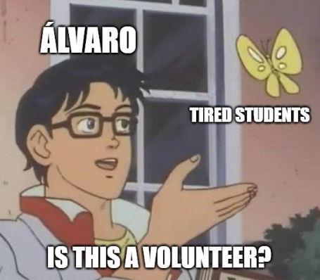

## The goal of *good* research

 

> To *“produce valid inferences about social and political life”* (King, Keohane, & Verba 1994, p. 3)

. . .

 

**What is inference?**

 

. . .

The process of drawing conclusions from what we **observe** to what we do **not (yet) observe**.

## Scientific inference

 

Inferences that draw on evidence and reasoning, following a series of rules (or methods)

. . .

 

*The methods make the science, not the content*

- They must be **public**  
- They must provide a **measure of uncertainty**  
  *(scientific conclusions are always tentative!)*

## Components of a research design

 

- **Research question** (this session)  
- **Theory** (session 3)  
- **Data** (session 4)  
- **Methods**: depend on inferential goals (sessions 5, 6, 7), resources, and data availability (sessions 8, 9, 10).  
  We will focus on **quantitative methods** (sessions 11, 12, 13)

## The research question

There is no logical recipe for having good ideas.  

. . .

It depends on interest, creativity, knowledge... and luck.  

. . .

However, some guidelines:  

- Must be **relevant**  
- Answering it should make a **contribution**  
  (know your literature! or goal — e.g., private company)  
- Should be **researchable** (realistic plans to answer it!)
- Should be **focused**

## Types of research questions

 

| Question      | Focus        | Example                                |
|---------------|-------------|----------------------------------------|
| **What**      | Descriptive | What is voter turnout in country X?    |
| **How**       | Explanatory | How do campaigns influence turnout?    |
| **Why**       | Causal      | Why do some groups vote more than others? |

 

## Group exercise: Think of a research question!

. . .

- Take **two minutes** to write a research question on something that interests you  
- Choose a partner next to you and share your research question  
- Your partner should do the same with you  
- Assess your partner's question (**three minutes**):  
  - Does it meet the criteria above?  
  - How could it be improved?  

## Share your research question!

 

{fig-align="center"}

## Conclusion

 

A good **research question** is the first component of an effective research design  

. . .

In two weeks, we will examine more of your research questions and assess how to connect them with a **theory and hypotheses**  

---

 

 

The ultimate goal of this course is to ***think like a social scientist*** 

. . .

 

Connect real-world observations to theory and methods

. . .

 

**Remain skeptical!**  

---

{fig-align="center"}

## Thanks! :slightly_smiling_face:

 

 

 

[alvaro.canalejo@unilu.ch](alvaro.canalejo@unilu.ch)

