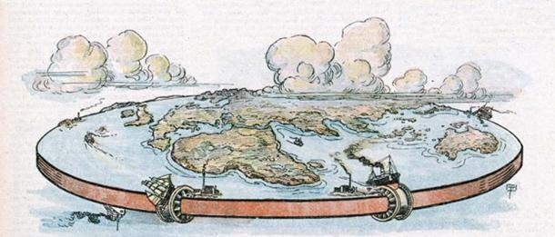
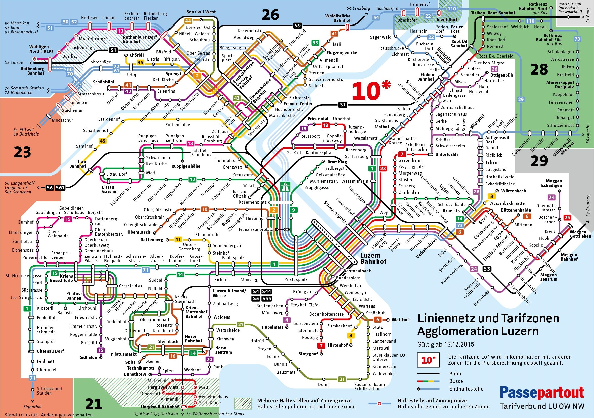
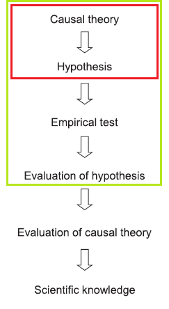

---

 

---

{fig-align="center"}

## What is a theory?

 

. . .

A **tentative conjecture** of how a phenomenon of the world works

 

. . .

Either implicitly or explicitly, it conveys a set of **causal relationships** between **concepts**

## Some social science examples

 

- **Rational Choice Theory** *(Downs)*  
Individuals vote to maximize utility

- **Partisan Identification Theory** *(Campbell et al.)*  
Partisanship as a “perceptual screen”  

- **Modernization Theory** *(Lipset)*  
Economic development fosters democracy  

- **Social Identity Theory** *(Tajfel & Turner)*  
Group membership shapes leads to group bias

## Good theories should be...

 

- **Causal** *(explain why something happen)*

- **Non-normative** *(does not prescribe what ought to happen)*

- **General** *(work across contexts)*

- **Parsimonious** *(explain much with little)*

## From ideas to good theories

*Again, no magic formula!*

 

. . .

But some ***strategies***:

- Is it **relevant**? (starting with the RQ)  
- Is there **interesting variation**? (e.g., puzzles)  
- Are they **rooted in knowledge of the world** (specific events, local without pronouns)  
- Do they **build on the literature** (e.g., gaps, extensions, implications)

## From theories to models

 

. . .

A **model** is a *simplified* representation of reality

 

. . .

> *“All models are wrong, but some are **useful**.”*  
> — George E. P. Box

---

## When are models useful?

 

. . .

In a research design context, models are **useful** because they **bridge the gap between theory and hypotheses**

 

. . .

**Models** are a **simplified version of a theory** that focus on specific concepts and relationships

 

By removing complexity, they help us make theoretical claims **testable** (and thus falsifiable)  

. . .

⟶ *More later on* ***hypotheses***

## Thinking in terms of variables 

. . .

 

**Variables** are how we represent the **concepts** in our model

 

. . .

- **Dependent variable (DV):**  The outcome we want to explain  

- **Independent variable (IV):**  The factor(s) we think explain the DV 

- **Other variables:** Moderators, mediators, confounders...

## Models as variables and relationships

. . .

Examples with **Directed Acyclic Graphs (DAGs)**:

 

$$
\begin{array}{ll}
1. & X \longrightarrow Y
\end{array}
$$

$$
\begin{array}{ll}
2. & X \longrightarrow M \longrightarrow Y
\end{array}
$$

$$
\begin{array}{ll}
3. &
  \begin{array}{ccc}
     & Z &  \\
     & \swarrow \searrow &  \\
    X & \longrightarrow & Y
  \end{array}
\end{array}
$$

## From models to hypotheses

 

. . .

**Models** specify relationships between variables

**Hypotheses** translate those relationships into testable claims

 

. . .

**Example:**  
*Model*: 
Election results ⟶ Satisfaction with democracy  

*Hypothesis*:  
Individuals who voted for a party that lost the election  
will report **lower satisfaction with democracy**.

## Hypotheses

 

A **hypothesis** is a testable statement about the expected relationship between variables.  

- **Non-directional hypothesis:** only states there is a relationship, not its direction.  
  - E.g. Income is related to voting turnout.  

- **Directional hypothesis:** specifies the *direction* of the relationship.  
  - E.g. Higher income increases the likelihood of voting turnout.  

Directional hypotheses can be **positive** (variables move in the same direction) or **negative** (variables move in opposite directions).

## RQs, theory and hypotheses

 

::: {.columns}

::: {.column width="30%" .fragment}

Motivating

question  

 

<svg height="120" width="30" xmlns="http://www.w3.org/2000/svg">
  <defs>
    <marker id="arrowhead" markerWidth="10" markerHeight="7" 
            refX="5" refY="3.5" orient="auto">
      <polygon points="0 0, 10 3.5, 0 7" fill="black"/>
    </marker>
  </defs>
  <line x1="15" y1="0" x2="15" y2="100" 
        stroke="black" stroke-width="3" 
        marker-end="url(#arrowhead)"/>
</svg>

 

**Theory**

:::

::: {.column width="7.5%" .fragment}

 

 

 

 

 

 

⟶

:::

::: {.column width="25%" .fragment}

 

 

 

 

 

 

***Model***

:::

::: {.column width="7.5%" .fragment}

 

 

 

 

 

 

⟶

:::

::: {.column width="30%" .fragment}

Empirical

question  

 

<svg height="120" width="30" xmlns="http://www.w3.org/2000/svg">
  <defs>
    <marker id="arrowhead" markerWidth="10" markerHeight="7" 
            refX="5" refY="3.5" orient="auto">
      <polygon points="0 0, 10 3.5, 0 7" fill="black"/>
    </marker>
  </defs>
  <line x1="15" y1="0" x2="15" y2="100" 
        stroke="black" stroke-width="3" 
        marker-end="url(#arrowhead)"/>
</svg>
 

 

**Hypothesis**

:::

:::

# Conclusion

## Theory and research design

## Next session (16:15)

 

Data and Measurement

 

 

. . .

**Before...**

 

Presentation by **Laura Rios Quiroz**:

*Heroes and villains: motivated projection of political identities*

---

{fig-align="center"}

## Thanks! :slightly_smiling_face:

 

 

 

[alvaro.canalejo@unilu.ch](alvaro.canalejo@unilu.ch)

