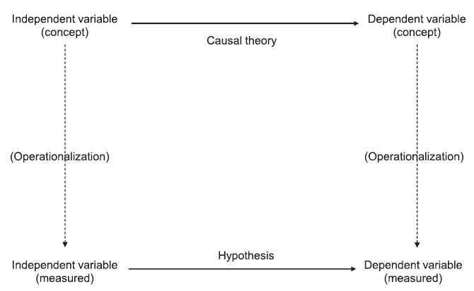
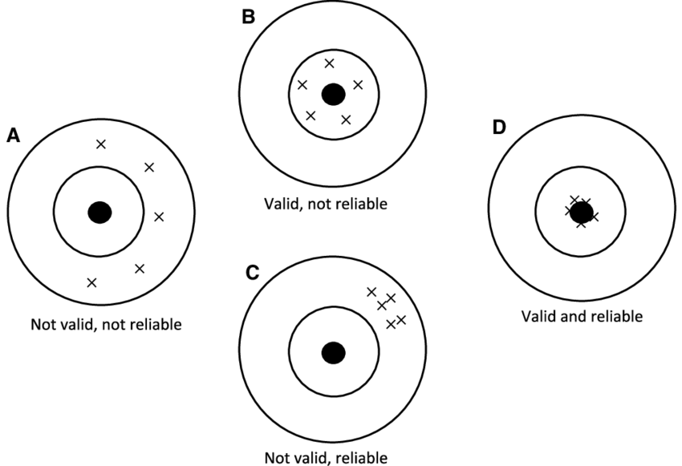
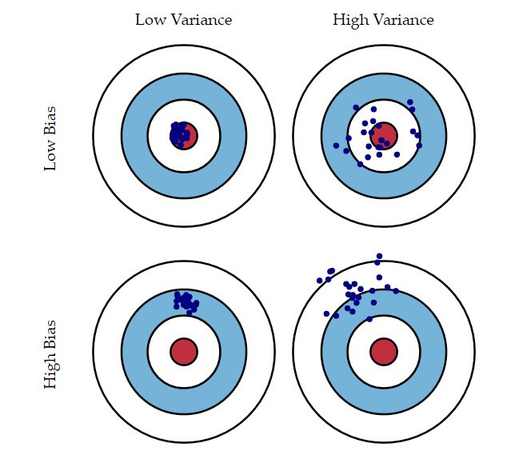
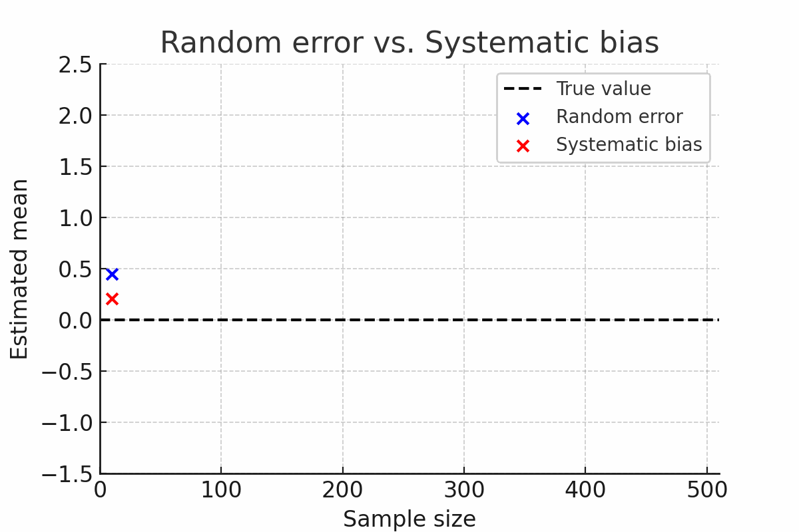
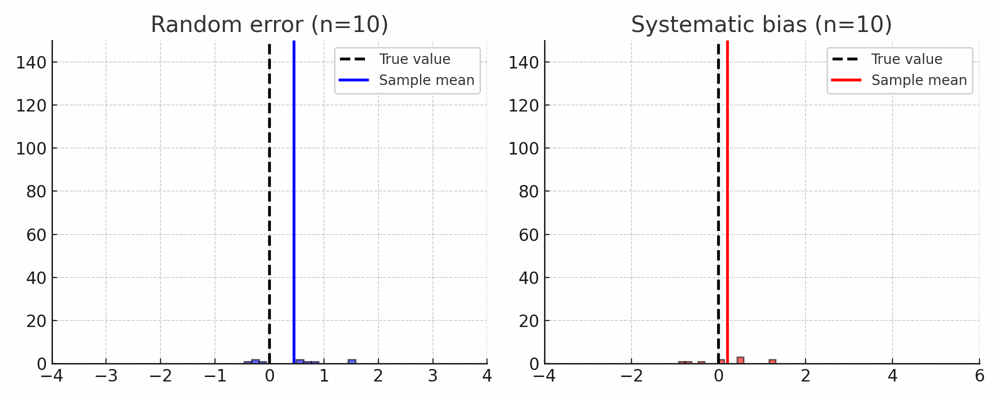
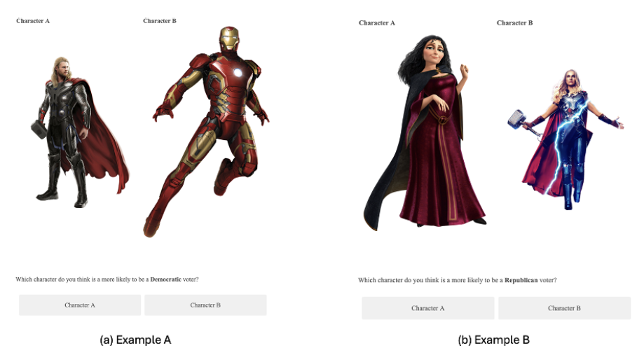
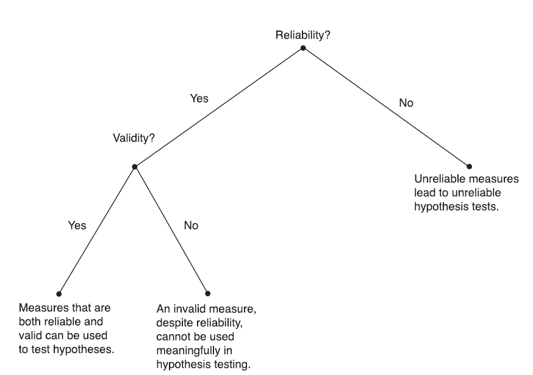

## Summary overview

 

::: {.columns}

::: {.column width="30%"}

Motivating

question  

 

<svg height="120" width="30" xmlns="http://www.w3.org/2000/svg">
  <defs>
    <marker id="arrowhead" markerWidth="10" markerHeight="7" 
            refX="5" refY="3.5" orient="auto">
      <polygon points="0 0, 10 3.5, 0 7" fill="black"/>
    </marker>
  </defs>
  <line x1="15" y1="0" x2="15" y2="100" 
        stroke="black" stroke-width="3" 
        marker-end="url(#arrowhead)"/>
</svg>

 

**Theory**

:::

::: {.column width="7.5%"}

 

 

 

 

 

 

⟶

:::

::: {.column width="25%"}

 

 

 

 

 

 

***Model***

:::

::: {.column width="7.5%"}

 

 

 

 

 

 

⟶

:::

::: {.column width="30%"}

Empirical

question  

 

<svg height="120" width="30" xmlns="http://www.w3.org/2000/svg">
  <defs>
    <marker id="arrowhead" markerWidth="10" markerHeight="7" 
            refX="5" refY="3.5" orient="auto">
      <polygon points="0 0, 10 3.5, 0 7" fill="black"/>
    </marker>
  </defs>
  <line x1="15" y1="0" x2="15" y2="100" 
        stroke="black" stroke-width="3" 
        marker-end="url(#arrowhead)"/>
</svg>
 

 

**Hypothesis**

:::

:::

---

## Variables and hypotheses

. . .

 

Theoretical models put forward an expected relationship between **variables**  

However, these variables are normally **abstract concepts**, not directly observable in reality  

 

. . .

E.g., ***Political sophistication***

*Definition:* how knowledgeable citizens are about politics

. . .

Do we observe it in reality ❓

## Operationalization

. . .

 

It is the translation of variables into **empirical indicators**

The goal is to turn our theory into **testable hypotheses** 

 

. . .

For that, we use **observational manifestations** of abstract variables

- Sometimes straightforward: e.g., *income → salary ($)*  
- Sometimes not straightforward: e.g., *political sophistication → political knowledge survey questions*  

---

 

## Assessing measurement
 
. . .
 
Two main *criteria*:  

- **Reliability:** the extent to which a measure produces consistent results  

- **Validity:** the extent to which a measure captures the concept it is supposed to  

    - Face validity
    - Content validity
    - Construct validity

## Reliable vs. valid measures

. . .

{width=70% fig-align="center"}

## Measurement error vs. bias

{width=70% fig-align="center"}

---

---

 

## Assessing validity

. . .

- **Face validity**  

Does the indicator look like it measures the concept? (e.g., *I know it when I see it*)

- **Content validity**  

Does the indicator capture the full range of the concept?

- **Construct validity**  

Does the indicator behave as theory predicts it should, in relation to other variables?

---

## Beyond reliability and validity...

. . . 

{width=85%}

---

{fig-align="center"}

## Group exercise

. . .

Pair up and evaluate each other’s answers to the Session 3 and Session 4 questions.  

 

**1. Check your partner’s research question and hypothesis (Session 3):**  
- Can you identify the main argument of your partner’s theory? Is it correct?  
- Can you refine the research question and hypothesis to make them more consistent with the theory? 

 

**2. Check the empirical indicators your partner proposed (Session 4):**  
- Can you suggest better empirical indicators for the variables?  
- Can you agree together on the best indicators?  

# Conclusion

---

{width=75%}

## Next session (23.10.25 - 14:15)

 

Descriptive Inference

 

 

. . .

**Before...**

 

Presentation by **Olivia Lea Landis**:

*Measuring democratic backsliding*

---

{fig-align="center"}

## Choose R track & get a presentation slot!

{fig-align="center"}

## Thanks! :slightly_smiling_face:

 

 

 

[alvaro.canalejo@unilu.ch](alvaro.canalejo@unilu.ch)

