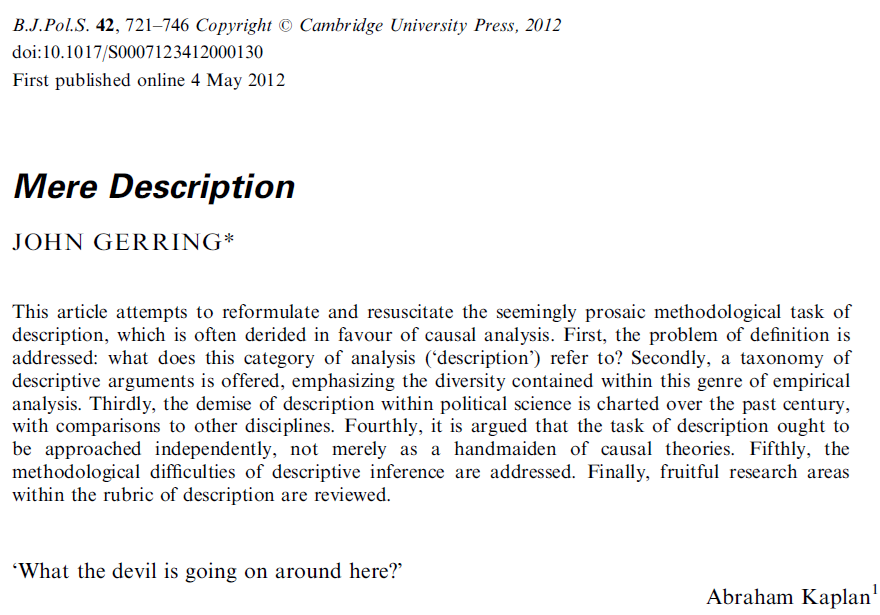
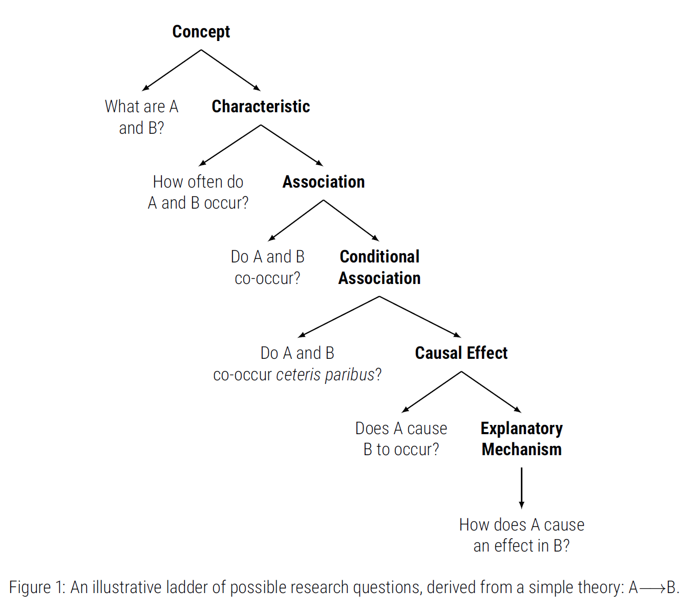

## Research design overview

<br>

- Research question(s)

- Theory and hypotheses

- Variables and data measurement

. . .

- Empirical strategies

  → They depend on our **goals**

## Descriptive inference

> The goal of *good* research is to *“produce valid inferences about social and political life”* (King, Keohane, & Verba 1994, p. 3)

. . .

<br>

What is **descriptive** inference?

. . . 

<br>

→ To infer **features** [(including associations, but non-causal relationships)]{style="color:gray"} of a broader population

## Two main goals

<br>

- Infer descriptive information about **<span class="fragment highlight-red">one variable</span>**


- Infer descriptive information about **two or more variables**

## A practical example: our classroom

```{r}
#| echo: false

# Load libraries
library(dplyr)
library(stringr)

# Create dataset 
data <- tribble(
  ~Surname,         ~Name,
  "Brown",          "Elli Margaret",
  "Demir",          "Rojhat Yigit",
  "Djogova",        "Nikolina",
  "Eymann",         "Bernhard",
  "Flütsch",        "Reto",
  "Gaggini",        "Clelia",
  "Graf",           "Robin",
  "Hager",          "Lisa Anna",
  "Herrera Garcia", "Juan Manuel",
  "Hofer",          "Nadja Alexandra",
  "Klamt",          "Reachel",
  "Landis",         "Olivia Lea",
  "Lunkova",        "Anastasiia",
  "Michel",         "Fabian",
  "Moses",          "Emmanuel Saba",
  "Paraboni",       "Giulio",
  "Rios Quiroz",    "Laura",
  "Robatel",        "Annick France",
  "Schwegler",      "Salome Claudia"
)

# Combine Surname and Name into Full_Name
data <- data |>
  mutate(
    Full_Name = paste(Surname, Name),
    
    # Simple heuristic to infer gender
    Gender = case_when(
      Name %in% c("Bernhard", "Reto", "Robin", "Juan Manuel", "Fabian",
                  "Emmanuel Saba", "Giulio", "Rojhat Yigit") ~ "Male",
      TRUE ~ "Female"
    ),
    
    # Count number of words in full name
    Name_Length = str_length(str_remove_all(Full_Name, "\\s"))
  ) |>
  select(Full_Name, Gender, Name_Length)

```


. . .

- Population: UniLu students

- Sample: ***you!*** Our classroom

- Variables:

  - Gender [(apologies for the assumption!)]{style="color:gray"}: **categorical**

  - Name length (in number of letters): **continuous**

. . .

Other variable type?

. . .

→ **Ordinal**: ranked values without exact same distance between  values

## A look into our data

```{r}
#| echo: true
#| results: false
#| code-line-numbers: "|1"

# Show whole dataset
data
```

::: {.fragment}

```{r}
#| echo: false
#| results: hold

# Show whole dataset
data
```

:::

## Barplot: categorical variables

::: {.panel-tabset}

### Output

```{r}
#| echo: false
#| message: false
#| warning: false
#| eval: true

library(ggplot2)

# Bar plot of gender
ggplot(data, aes(x = Gender, fill = Gender)) +
  geom_bar() +
  scale_fill_manual(values = c("Female" = "#A1C9F4", "Male" = "#FFB482")) +
  labs(
    title = "Gender distribution in the class",
    x = "Gender",
    y = "Count"
  ) +
  theme_minimal(base_size = 14) +
  theme(legend.position = "none")
```

### Code

```{r}
#| echo: true
#| message: false
#| warning: false
#| eval: false

library(ggplot2)

# Bar plot of gender
ggplot(data, aes(x = Gender, fill = Gender)) +
  geom_bar() +
  scale_fill_manual(values = c("Female" = "#A1C9F4", "Male" = "#FFB482")) +
  labs(
    title = "Gender distribution in the class",
    x = "Gender",
    y = "Count"
  ) +
  theme_minimal(base_size = 14) +
  theme(legend.position = "none")
```

:::

## Histogram: continuous variables

::: {.panel-tabset}

### Output

```{r}
#| echo: false
#| message: false
#| warning: false
#| eval: true

library(ggplot2)

# Histogram with density overlay
ggplot(data, aes(x = Name_Length)) +
  geom_histogram(aes(y = ..density..),bins = 6, fill = "#A1C9F4", color = "white", alpha = 0.7) +
  geom_density(color = "#FFB482", size = 1.2) +
  labs(
    title = "Distribution of name length",
    x = "Name length (letters)",
    y = "Density") +
  theme_minimal(base_size = 14)
```

### Code

```{r}
#| echo: true
#| message: false
#| warning: false
#| eval: false

library(ggplot2)

# Histogram with density overlay
ggplot(data, aes(x = Name_Length)) +
  geom_histogram(aes(y = ..density..),bins = 10, fill = "#A1C9F4", color = "white", alpha = 0.7) +
  geom_density(color = "#FFB482", size = 1.2) +
  labs(
    title = "Distribution of name length (letters, no spaces)",
    x = "Name length (letters)",
    y = "Density") +
  theme_minimal(base_size = 14)
```

:::

## Central tendency measures: categorical variables

::: {.fragment}


```{r}
#| echo: true
#| results: false
#| message: false
#| code-line-numbers: "|3"

library(dplyr)

# Mode for the categorical variable (Gender)
mode_gender <- data |>
  count(Gender) |>
  slice_max(n, n = 1) |>
  pull(Gender)

mode_gender

```

:::

::: {.fragment}


```{r}
#| echo: false
#| results: hold
#| message: false

library(dplyr)

# Mode for the categorical variable (Gender)
mode_gender <- data |>
  count(Gender) |>
  slice_max(n, n = 1) |>
  pull(Gender)

mode_gender

```

:::

## Central tendency measures: continuous variables

::: {.fragment}

```{r}
#| echo: true
#| results: false
#| message: false
#| code-line-numbers: "|3"

library(dplyr)

# Mean and Median for the continuous variable (Name_Length)
data |>
  summarise(
    mean_length = mean(Name_Length),
    median_length = median(Name_Length)
  )
```

:::

::: {.fragment}

```{r}
#| echo: false
#| results: hold
#| message: false

library(dplyr)

# Mean and Median for the continuous variable (Name_Length)
data |>
  summarise(
    mean_length = mean(Name_Length),
    median_length = median(Name_Length)
  )
```

:::

## Dispersion (spread measures)

::: {.fragment}

```{r}
#| echo: true
#| results: false
#| message: false
#| code-line-numbers: "|3"

library(dplyr)

# Dispersion measures (name lenght)
data |>
  summarise(
    variance = var(Name_Length),
    sd = sd(Name_Length),
    range = max(Name_Length) - min(Name_Length),
    q1 = quantile(Name_Length, 0.25),
    q3 = quantile(Name_Length, 0.75),
    iqr = IQR(Name_Length)
  )
```

:::

::: {.fragment}

```{r}
#| echo: false
#| results: hold
#| message: false

library(dplyr)

# Dispersion measures (name lenght)
data |>
  summarise(
    variance = var(Name_Length),
    sd = sd(Name_Length),
    range = max(Name_Length) - min(Name_Length),
    q1 = quantile(Name_Length, 0.25),
    q3 = quantile(Name_Length, 0.75),
    iqr = IQR(Name_Length)
  )
```

:::

## Boxplot: continuous variables

::: {.panel-tabset}

### Output

```{r}
#| echo: false
#| message: false
#| warning: false
#| eval: true

library(ggplot2)

ggplot(data, aes(x = "", y = Name_Length)) +
  geom_boxplot(width = 0.3, fill = "#A1C9F4", color = "gray40") +
  labs(
    title = "Box-and-Whisker Plot of Name Lengths",
    x = NULL,
    y = "Name Length (letters)"
  ) +
  theme_minimal(base_size = 14) +
  theme(axis.text.x = element_blank(),
        axis.ticks.x = element_blank())
```

### Code

```{r}
#| echo: true
#| message: false
#| warning: false
#| eval: false

library(ggplot2)

ggplot(data, aes(x = "", y = Name_Length)) +
  geom_boxplot(width = 0.3, fill = "#A1C9F4", color = "gray40") +
  labs(
    title = "Box-and-Whisker Plot of Name Lengths",
    x = NULL,
    y = "Name Length (letters)"
  ) +
  theme_minimal(base_size = 14) +
  theme(axis.text.x = element_blank(),
        axis.ticks.x = element_blank())
```

:::

## Summary of descriptive measures

<br> 

<div style="font-size:70%; line-height:1.2;">

| **Measure** | **Symbol / Formula** | **Meaning** |
|--------------|----------------------|--------------|
| **Mode** | — | Most frequent value |
| **Median** | — | Middle observation |
| **Mean** | $\bar{X} = \frac{\sum X_i}{n}$ | Average value |
| **IQR** | $Q_3 - Q_1$ | Middle 50% range |
| **Variance** | $s^2 = \frac{\sum (X_i - \bar{X})^2}{n - 1}$ | Spread (squared units) |
| **Std. Deviation** | $s = \sqrt{s^2}$ | Spread (original units) |
| **Skewness** | $g_1 = \frac{\sum (X_i - \bar{X})^3 / n}{s^3}$ | Asymmetry |
| **Kurtosis** | $g_2 = \frac{\sum (X_i - \bar{X})^4 / n}{s^4}$ | Peakedness |

</div>

## Bivariate relationship plot

::: {.panel-tabset}

### Output

```{r}
#| echo: false
#| message: false
#| warning: false
#| eval: true

library(ggplot2)

ggplot(data, aes(x = Gender, y = Name_Length, fill = Gender)) +
  geom_boxplot(alpha = 0.8, width = 0.5, color = "gray40") +
  scale_fill_manual(values = c("Female" = "#A1C9F4", "Male" = "#FFB482")) +
  labs(
    title = "Name Length by Gender",
    x = "Gender",
    y = "Name Length (letters)"
  ) +
  theme_minimal(base_size = 14) +
  theme(legend.position = "none")
```

### Code

```{r}
#| echo: true
#| message: false
#| warning: false
#| eval: false

library(ggplot2)

ggplot(data, aes(x = Gender, y = Name_Length, fill = Gender)) +
  geom_boxplot(alpha = 0.8, width = 0.5, color = "gray40") +
  scale_fill_manual(values = c("Female" = "#A1C9F4", "Male" = "#FFB482")) +
  labs(
    title = "Name Length by Gender",
    x = "Gender",
    y = "Name Length (letters)"
  ) +
  theme_minimal(base_size = 14) +
  theme(legend.position = "none")
```

:::

## Good descriptive inference

. . .

<br>

**Good estimators are:**

- **Unbiased** → valid  

- **Consistent** → reliable  

- **Efficient** → precise  

. . .

→  Ultimately, how **useful** is your description for your [**theory**]{style="color:red"}?

---

{fig-align="center"}


## 

{fig-align="center"}

## 

:::: {.columns}

::: {.column width="50%"}

**Share your descriptive question!**

[*Seminar questions 5*]{style="color:gray"}

<br>

- What is your question?

- How is it useful for your theory?

:::

::: {.column width="50%"}

{width=75% fig-align="center"}

:::

::::


## Next session (16:15)

<br>

*→ Causal Inference*

<br>

. . .

**Before...**

<br>

Presentation by **Lisa Anna Hager & Annick France Robatel**:

*The Manosphere and politics*

---

{fig-align="center"}

## Thanks! :slightly_smiling_face:

<br>

<br>

<br>

<center>[alvaro.canalejo@unilu.ch](alvaro.canalejo@unilu.ch)</center>