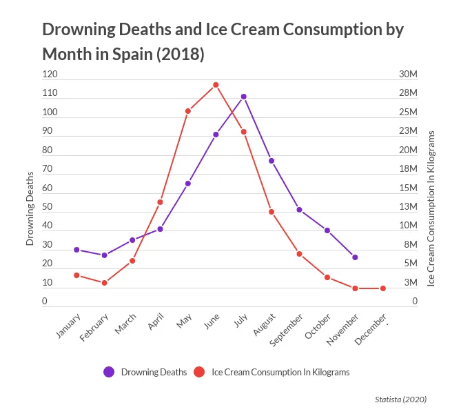
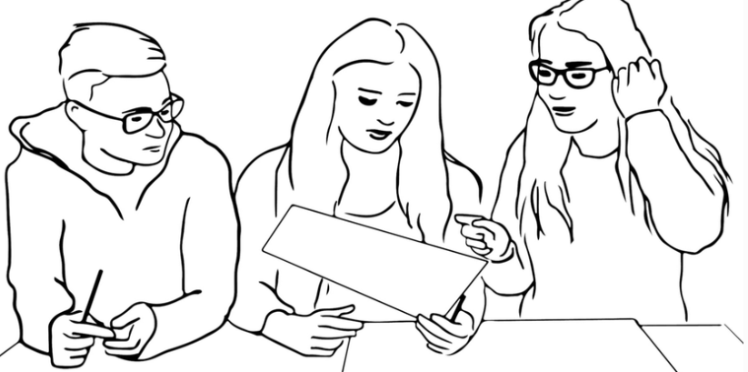

## Correlation

<br>

. . .

The extent to which two variables co-occur (i.e. occur together)

- *Positive* correlation
  
- *Negative* correlation

- *Uncorrelated*

## Extending our classroom data

```{r}
#| echo: false

# Load libraries
library(dplyr)
library(stringr)

# Create dataset 
data <- tribble(
  ~Surname,         ~Name,
  "Brown",          "Elli Margaret",
  "Demir",          "Rojhat Yigit",
  "Djogova",        "Nikolina",
  "Eymann",         "Bernhard",
  "Flütsch",        "Reto",
  "Gaggini",        "Clelia",
  "Graf",           "Robin",
  "Hager",          "Lisa Anna",
  "Herrera Garcia", "Juan Manuel",
  "Hofer",          "Nadja Alexandra",
  "Klamt",          "Reachel",
  "Landis",         "Olivia Lea",
  "Lunkova",        "Anastasiia",
  "Michel",         "Fabian",
  "Moses",          "Emmanuel Saba",
  "Paraboni",       "Giulio",
  "Rios Quiroz",    "Laura",
  "Robatel",        "Annick France",
  "Schwegler",      "Salome Claudia"
)

# Combine Surname and Name into Full_Name
data <- data |>
  mutate(
    Full_Name = paste(Surname, Name),
    
    # Simple heuristic to infer gender
    Gender = case_when(
      Name %in% c("Bernhard", "Reto", "Robin", "Juan Manuel", "Fabian",
                  "Emmanuel Saba", "Giulio", "Rojhat Yigit") ~ "Male",
      TRUE ~ "Female"
    ),
    
    # Count number of words in full name
    Name_Length = str_length(str_remove_all(Full_Name, "\\s"))
  ) |>
  select(Full_Name, Gender, Name_Length)

# For random jitter reproducibility
set.seed(789)

# Add ChatGPT (v5) estimated ages
data <- data |>
  mutate(
    Age_Base = case_when(
      Full_Name == "Brown Elli Margaret" ~ 30,
      Full_Name == "Demir Rojhat Yigit" ~ 30,
      Full_Name == "Djogova Nikolina" ~ 30,
      Full_Name == "Eymann Bernhard" ~ 60,
      Full_Name == "Flütsch Reto" ~ 50,
      Full_Name == "Gaggini Clelia" ~ 40,
      Full_Name == "Graf Robin" ~ 30,
      Full_Name == "Hager Lisa Anna" ~ 30,
      Full_Name == "Herrera Garcia Juan Manuel" ~ 40,
      Full_Name == "Hofer Nadja Alexandra" ~ 40,
      Full_Name == "Klamt Reachel" ~ 30,
      Full_Name == "Landis Olivia Lea" ~ 20,
      Full_Name == "Lunkova Anastasiia" ~ 30,
      Full_Name == "Michel Fabian" ~ 30,
      Full_Name == "Moses Emmanuel Saba" ~ 40,
      Full_Name == "Paraboni Giulio" ~ 40,
      Full_Name == "Rios Quiroz Laura" ~ 30,
      Full_Name == "Robatel Annick France" ~ 60,
      Full_Name == "Schwegler Salome Claudia" ~ 30,
      TRUE ~ NA_real_
    ),
    # Add random variation between -3 and +3 years
    Age_Est = Age_Base + sample(-9:9, n(), replace = TRUE)
  )


```

- New **continuous variable**: inferred age (ChatGPT v5)

. . .

::: {.panel-tabset}

### Data check


```{r}
#| echo: true
#| message: false
#| warning: false
#| code-line-numbers: "|1"
#| eval: false

# View first few rows of the new variable
head(data %>% select(Full_Name, Age_Est))
```

::: {.fragment}

```{r}
#| echo: false
#| message: false
#| warning: false
#| code-line-numbers: "|1"

# View first few rows of the new variable
head(data %>% select(Full_Name, Age_Est))
```

:::

### Prompt

"Infer the approximate age in 2025 for each person in this list of names based on European naming patterns, but add some random variation (±9 years) to make the estimates look more realistic."

### Justifications

<div style="font-size:70%; line-height:1.2;">

| Full Name | Est. Age | Reason |
|------------|-----------|--------|
| Elli Margaret Brown | 30 | Modern revival of Elli, 1990s–2000s |
| Rojhat Yigit Demir | 30 | Common among 1990s Turkish names |
| Nikolina Djogova | 30 | Popular in 1990s Balkans |
| Bernhard Eymann | 60 | Classic mid-20th-century name |
| Reto Flütsch | 50 | Typical Swiss 1970s–80s |
| Clelia Gaggini | 40 | Italian 1980s style |
| Robin Graf | 30 | 1990s unisex trend |
| Lisa Anna Hager | 30 | 1980s–90s peak |
| Juan Manuel Herrera Garcia | 40 | Spanish 1970s–80s double name |
| Nadja Alexandra Hofer | 40 | 1970s–80s Germanic pair |
| Reachel Klamt | 30 | 1990s variant of Rachel |
| Olivia Lea Landis | 20 | Olivia boom after 2000 |
| Anastasiia Lunkova | 30 | Eastern Europe 1990s |
| Fabian Michel | 30 | German 1980s–90s |
| Emmanuel Saba Moses | 40 | Stable 1970s–80s name |
| Giulio Paraboni | 40 | Italian 1970s–80s |
| Laura Rios Quiroz | 30 | 1980s–90s international peak |
| Annick France Robatel | 60 | French 1950s–60s |
| Salome Claudia Schwegler | 30 | Swiss revival 1980s–90s |

</div>

:::

## Visualizing correlations

::: {.panel-tabset}

### Output

```{r}
#| echo: false
#| message: false
#| warning: false
#| eval: true

library(ggplot2)

ggplot(data, aes(x = Age_Est, y = Name_Length)) +
  geom_point(size = 3, color = "black", alpha = 0.8) +
  geom_abline(
    intercept = coef(lm(Name_Length ~ Age_Est, data = data))[1],
    slope = coef(lm(Name_Length ~ Age_Est, data = data))[2],
    color = "gray40",
    linewidth = 1.1
  ) +
  labs(
    title = "Relationship Between Estimated Age and Name Length",
    x = "Estimated Age (years)",
    y = "Name Length (letters)"
  ) +
  theme_minimal(base_size = 14)
```

### Code

```{r}
#| echo: true
#| message: false
#| warning: false
#| eval: false

library(ggplot2)

ggplot(data, aes(x = Age_Est, y = Name_Length)) +
  geom_point(size = 3, color = "black", alpha = 0.8) +
  geom_abline(
    intercept = coef(lm(Name_Length ~ Age_Est, data = data))[1],
    slope = coef(lm(Name_Length ~ Age_Est, data = data))[2],
    color = "gray40",
    linewidth = 1.1
  ) +
  labs(
    title = "Relationship Between Estimated Age and Name Length",
    x = "Estimated Age (years)",
    y = "Name Length (letters)"
  ) +
  theme_minimal(base_size = 14)
```

:::

## Possible correlations

::: {.panel-tabset}

### Output

```{r}
#| echo: false
#| message: false
#| warning: false
#| eval: true

library(ggplot2)

set.seed(123)  # ensure reproducibility

# simulate three datasets: positive, negative, and no correlation
df <- data.frame(
  x = rep(1:50, 3),
  y = c(1:50 + rnorm(50,0,5),   # positive
        50:1 + rnorm(50,0,5),   # negative
        rnorm(50,25,5)),        # none
  type = rep(c("Positive", "Negative", "None"), each = 50)
)

# plot all three side by side
ggplot(df, aes(x, y)) +
  geom_point() +
  stat_smooth(method = "lm", se = FALSE, color = "gray40", linewidth = 1) +
  facet_wrap(~type) +
  theme_minimal()
```

### Code

```{r}
#| echo: true
#| message: false
#| warning: false
#| eval: false

library(ggplot2)

set.seed(123)  # ensure reproducibility

# simulate three datasets: positive, negative, and no correlation
df <- data.frame(
  x = rep(1:50, 3),
  y = c(1:50 + rnorm(50,0,5),   # positive
        50:1 + rnorm(50,0,5),   # negative
        rnorm(50,25,5)),        # none
  type = rep(c("Positive", "Negative", "None"), each = 50)
)

# plot all three side by side
ggplot(df, aes(x, y)) +
  geom_point() +
  stat_smooth(method = "lm", se = FALSE, color = "gray40", linewidth = 1) +
  facet_wrap(~type) +
  theme_minimal()
```

:::

## Non-linearities

::: {.panel-tabset}

### Output

```{r}
#| echo: false
#| message: false
#| warning: false
#| eval: true

library(ggplot2)

set.seed(123)

# simulate three nonlinear datasets with same linear slope ~0
df <- data.frame(
  x = rep(seq(1, 50, length.out = 50), 3),
  y = c(25 + 10 * sin(seq(1, 50, length.out = 50)),          # sine wave
        25 + (seq(1, 50, length.out = 50) - 25)^2 / 25,      # U-shape
        25 + abs(seq(1, 50, length.out = 50) - 25) + rnorm(50)), # V + noise
  type = rep(c("Sine pattern", "U-shape", "V-shape"), each = 50)
)

# add random noise
df$y <- df$y + rnorm(nrow(df), 0, 2)

# plot with points + misleading linear fit
ggplot(df, aes(x, y)) +
  geom_point() +
  stat_smooth(method = "lm", se = FALSE, color = "gray40") +
  facet_wrap(~type) +
  theme_minimal()
```

### Code

```{r}
#| echo: true
#| message: false
#| warning: false
#| eval: false

library(ggplot2)

set.seed(123)

# simulate three nonlinear datasets with same linear slope ~0
df <- data.frame(
  x = rep(seq(1, 50, length.out = 50), 3),
  y = c(25 + 10 * sin(seq(1, 50, length.out = 50)),          # sine wave
        25 + (seq(1, 50, length.out = 50) - 25)^2 / 25,      # U-shape
        25 + abs(seq(1, 50, length.out = 50) - 25) + rnorm(50)), # V + noise
  type = rep(c("Sine pattern", "U-shape", "V-shape"), each = 50)
)

# add random noise
df$y <- df$y + rnorm(nrow(df), 0, 2)

# plot with points + misleading linear fit
ggplot(df, aes(x, y)) +
  geom_point() +
  stat_smooth(method = "lm", se = FALSE, color = "gray40") +
  facet_wrap(~type) +
  theme_minimal()
```

:::

## Quantifying correlations

. . .

<br>

<div style="font-size:80%; line-height:1.2;">


**Covariance:** measures how two variables vary together → direction

$$
\mathrm{Cov}(X, Y) = \frac{\sum_{i=1}^{n} (X_i - \bar{X})(Y_i - \bar{Y})}{n - 1}
$$

<br>

**Pearson Correlation Coefficient:** standardized covariance (–1 to 1) → direction and strength  

$$
r_{XY} = \frac{\mathrm{Cov}(X, Y)}{s_X \, s_Y}
$$

</div>

## Covariance & correlation

::: {.fragment}


```{r}
#| echo: true
#| results: false
#| message: false
#| code-line-numbers: "|1"

# Covariance and correlation coefficient
cov(data$Name_Length, data$Age_Est, use = "complete.obs")
cor(data$Name_Length, data$Age_Est, use = "complete.obs")

```

:::

::: {.fragment}


```{r}
#| echo: false
#| results: hold
#| message: false

library(dplyr)

# Covariance and correlation coefficient
cov(data$Name_Length, data$Age_Est, use = "complete.obs")
cor(data$Name_Length, data$Age_Est, use = "complete.obs")

```

:::


## Correlation does not imply causation

<br>

. . .

corr(X,Y) ≠ X → Y

<br>

. . .

$$
1.\; Z \longrightarrow X,\; Z \longrightarrow Y \quad \text{(Confounding)}
$$

. . .

$$
2.\; Y \longrightarrow X \quad \text{(Reverse causation)}
$$

. . .

$$
3.\; X \longrightarrow M \longleftarrow Y \quad \text{(Collider / selection)}
$$

. . .

$$
4.\; T \longrightarrow X,\; T \longrightarrow Y \quad \text{(Common trend/shock)}
$$

---

{fig-align="center"}

## Causal inference

> The goal of *good* research is to *“produce valid inferences about social and political life”* (King, Keohane, & Verba 1994, p. 3)

. . .

<br>

What is **causal** inference?

. . . 

<br>

→ To infer **causal relationships** in a broader population


## Causation

> "A *causal effect* is a change in some feature of the world that would result from
a change to some other feature of the world." (Bueno de Mesquita & Fowler 2021, p. 37)

. . .

<br>

Social phenomena are **multicausal**, so our goal is not to find *the* single cause [*(e.g. what causes X?)*]{style="color:gray"}

. . .

Instead, we examine whether **changes in one variable** produce **changes in another** [*(e.g. does X have an effect on Y?)*]{style="color:gray"}

## The potential outcomes framework

<br>

For each unit *i*, we define two potential outcomes:

$$
Y_i(1) = \text{Outcome if exposed to the treatment} \\
Y_i(0) = \text{Outcome if not exposed to the treatment}
$$

The **causal effect** for that unit is:

$$
\tau_i = Y_i(1) - Y_i(0)
$$

---

{fig-align="center"}

---


Let treatment = studying more hours 📚

<br>

$Y_i(1)$ = Exam result if student $i$ studies a lot

$Y_i(0)$ = Exam result if student $i$ does not study

. . .

<br>

The individual causal effect is:

$$
\tau_i = Y_i(1) - Y_i(0)
$$

The **difference in exam results** between studying more and studying less

---

### The fundamental problem of causal inference

::: {.fragment}

<div style="font-size:70%; line-height:1.2;">

We can never observe both potential outcomes for the same unit:

$$
Y_i(1) \quad \text{and} \quad Y_i(0)
$$

- $Y_i(1)$: outcome if unit *i* receives the treatment  
- $Y_i(0)$: outcome if unit *i* does *not* receive the treatment  

</div>

:::

::: {.fragment}


<div style="font-size:80%; line-height:1.2;">

For each unit \(i\):

$$
Y_i = D_i Y_i + (1 - D_i) Y_i
$$

We observe **only one** of these...

</div>

:::

::: {.fragment}

<div style="font-size:80%; line-height:1.2;">

...the other is a [**counterfactual**]{style="color:red"}

</div>

:::


## The fundamental problem of causal inference

<br>

$$
\text{Causal Effect}_i = Y_i(1) - Y_i(0)
$$


<br>

***Causal effects*** are **unobservable at the individual level**

## How to solve the problem?

<br>

<br>

<br>

. . .

{fig-align="center"}

## But we can address it...


<br>

. . .

***Approximating*** [**counterfactuals**]{style="color:red"}

- Experimental studies [(session 8)]{style="color:gray"}

- Large-N observational analyses [(session 9)]{style="color:gray"}

- Small-N observational analysis [(session 10)]{style="color:gray"}

. . .

<br>

→ Advanced *causal inference* methods in the *applied readings* of sessions 11, 12 and 13

## Group exercise

<br>

. . .

In **pairs**:

1️⃣ Share your **causal claim** (*X → Y*) and its **counterfactual**

2️⃣ Discuss: Is it the **right counterfactual**?  

3️⃣ How could you **approximate it** in the real world?

{width=40% fig-align="center"}

## Next session (06.11.25 - 14:15)

<br>

*→ Predictive inference*

<br>

. . .

**Before...**

<br>

Presentation by **Clelia Gaggini & Emmanuel Saba Moses**:

*The effect of Mohamed Salah on Islamophobic behaviors and attitudes*

---

{fig-align="center"}

## Choose R track!

{fig-align="center"}

## Thanks! :slightly_smiling_face:

<br>

<br>

<br>

<center>[alvaro.canalejo@unilu.ch](alvaro.canalejo@unilu.ch)</center>