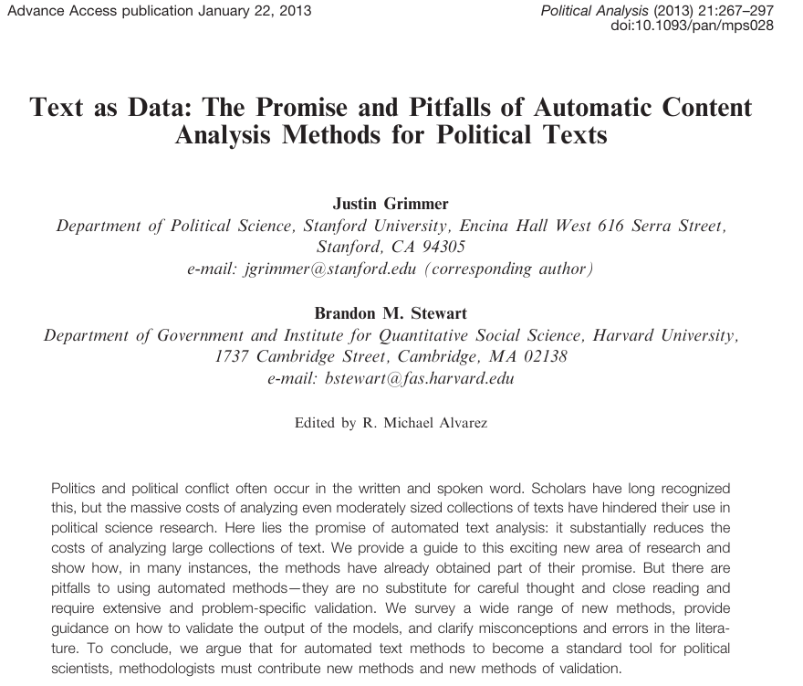

## Session 6 - Causal inference

. . .

 

The **fundamental problem of causal inference (FPCI)** 

$$
Y_i(1) = \text{Outcome if exposed to the treatment} \\
Y_i(0) = \text{Outcome if not exposed to the treatment} \\
$$

$$
\text{Individual treatment effect} = \tau_i = Y_i(1) - Y_i(0)
$$

. . .

 

We *address* FPCI by thinking in ***counterfactual*** terms

## Group exercise session 6

 

. . .

In **pairs**:

1️⃣ Share your **causal claim** (*X → Y*) and its **counterfactual**  

2️⃣ Discuss: Is it the **right counterfactual**?  

3️⃣ How could you **approximate it** in the real world?

{width=40% fig-align="center"}

# Predictive Inference

## Predictive inference

> The goal of *good* research is to *“produce valid inferences about social and political life”* (King, Keohane, & Verba 1994, p. 3)

. . .

 

What is **predictive** inference?

. . . 

 

→ Estimate **unobserved outcomes** (i.e., out-of-sample *Y* values) using information from sample data

---

{fig-align="center"}

## Forecasting the weather

- **Prediction** focuses on finding variables that improve forecasts
  
- We don’t need to know *how* or *why* relationships exist
  
. . .

 

**Cloudy skies** ☁️ suggests **higher chance of rain**, therefore **bring an umbrella! ☂️**

. . .

--- *We don't need to model the meteorological system!*

## Explanation vs. prediction

 

**Causal inference**: a change in one variable **causes** a change in another  

- The goal is to **identify causal relationships** by recovering **unbiased estimates** 
- We **don't care** about how well the model predicts outcomes

. . .

**Prediction**: a set of variables explain outcome values

- The goal is to maximize **explained variance**, even if estimates are *biased*

- We **don't care** about underlying causal relationships

## Forecasting elections

 

🗳️ What variables would you use to *forecast* election outcomes?

. . .

 

- 🤔 Are these variables **causally related** to voting?  

- 🎯 Are they **good predictors**?

## For what else might we want **prediction**?

 

. . .

Two additional examples:

 

→ **Text classification**  

→ **Generative AI (LLMs)**

---

{fig-align="center"}

## 📝 Text Classification

 

- Treats **text as data**: words or documents as variables

- The goal is to **predict categories or labels** (e.g., ideology, sentiment, topic) to *reduce costs* for large amounts of data

- The task itself is **predictive**, but the **goal is measurement**, enabling later **description or explanation**

## Evolving Methods

- Dictionary classification 

- Bag-of-words models  

- Topic models (e.g., LDA)  

- Word embeddings (e.g., word2vec, GloVe)  

- Contextual embeddings (e.g., BERT)  

- Large Language Models (LLMs)

**Note:** We don’t cover these methods here but **regression is the baseline!**

---

{fig-align="center"}

## 🤖 Generative AI

 

- Large Language Models (LLMs) **solve prediction problems** at scale

- They predict the **next word** (or token) given previous ones

- No understanding or causal reasoning — just **pattern-based prediction**

- Their uses can be multiple! (e.g., today's applied reading)

---

<iframe src="https://banana-projects-transformer-autocomplete.hf.space/doc/gpt2-large" width="100%" height="500px"></iframe>

# Conclusion

## When do we need prediction?

. . .

 

It depends on our ***research needs***!

 

. . .

- We may use **prediction as our final goal**, when forecasting itself is the objective

- Or we may use **prediction to solve a problem** that serves a larger aim (e.g., classification for measurement, forecasting experimental results for experimental design)

## Inferential goals summary

 

| **Type** | **What It Infers** | **Goal** |
|-----------|--------------------|-----------|
| **Descriptive** | **Summary information** | Describe features of *Y* |
| **Causal** | **Counterfactual outcomes** | Identify how changes in *X* affect *Y* |
| **Predictive** | **Unobserved outcomes** | Estimate values of *Y* |

## Next session (16:15)

 

*→ Experimental studies*

 

. . .

**Before...**

 

Presentation by **Fabian Michel**:

*Predicting results of social science experiments using large language models*

---

{fig-align="center"}

## Thanks! :slightly_smiling_face:

 

 

 

[alvaro.canalejo@unilu.ch](alvaro.canalejo@unilu.ch)
