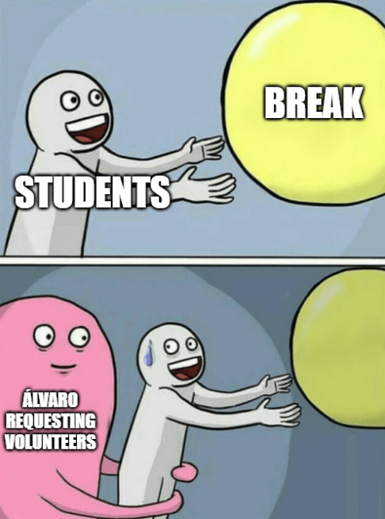

## Addressing the FPCI

<br>

<div style="font-size:70%; line-height:1.2;">

$$
Y_i(1) = \text{Outcome if exposed to the treatment} \\
Y_i(0) = \text{Outcome if not exposed to the treatment} \\
$$

$$
\text{Individual treatment effect} = \tau_i = Y_i(1) - Y_i(0) \\
$$

</div>

. . .

<br>

<div style="font-size:70%; line-height:1.2;">

$$
\text{Average Treatment Effect (ATE)} = \tau = E[Y_i(1) - Y_i(0)]
$$

</div>

## 🎓 Studying example

. . .

Our **quantity of interest (QOI)** is the **effect of studying** ($X$) on **grades** ($Y$)  

$$
\; X \longrightarrow Y \quad 
$$

. . .

We cannot observe the effect for an individual student $i$, but we can compare **average grades** of students who studied ($X = 1$) and those who did not ($X = 0$)

. . .

<br>

This **naïve comparison** provides an estimate of the effect of *X*, but is this the **ATE**?

## Simulated classroom data

```{r}
#| echo: false

# Load libraries
library(dplyr)
library(stringr)

# Create dataset 
data <- tribble(
  ~Surname,         ~Name,
  "Brown",          "Elli Margaret",
  "Demir",          "Rojhat Yigit",
  "Djogova",        "Nikolina",
  "Eymann",         "Bernhard",
  "Flütsch",        "Reto",
  "Gaggini",        "Clelia",
  "Graf",           "Robin",
  "Hager",          "Lisa Anna",
  "Herrera Garcia", "Juan Manuel",
  "Hofer",          "Nadja Alexandra",
  "Klamt",          "Reachel",
  "Landis",         "Olivia Lea",
  "Lunkova",        "Anastasiia",
  "Michel",         "Fabian",
  "Moses",          "Emmanuel Saba",
  "Paraboni",       "Giulio",
  "Rios Quiroz",    "Laura",
  "Robatel",        "Annick France",
  "Schwegler",      "Salome Claudia"
)

# Combine Surname and Name into Full_Name
data <- data |>
  mutate(
    Full_Name = paste(Surname, Name),
    
    # Simple heuristic to infer gender
    Gender = case_when(
      Name %in% c("Bernhard", "Reto", "Robin", "Juan Manuel", "Fabian",
                  "Emmanuel Saba", "Giulio", "Rojhat Yigit") ~ "Male",
      TRUE ~ "Female"
    ),
    
    # Count number of words in full name
    Name_Length = str_length(str_remove_all(Full_Name, "\\s"))
  ) |>
  select(Full_Name, Gender, Name_Length)

# Simulate study and grade variables
set.seed(123)  # for reproducibility

data <- data |>
  mutate(
    # Binary variable: probability of studying (some students study, some don't)
    Study = rbinom(n(), 1, 0.5),

    # Grades: base + effect of studying + random noise
    Grades = pmin(
      6,  # upper bound
      pmax(
        1,  # lower bound
        round(
          3 +                # base grade level
          3.2 * Study +      # positive effect of studying
          rnorm(n(), 0, 0.5),# random noise
          1
        )
      )
    )
  )
```


::: {.panel-tabset}

### Data check

```{r}
#| echo: true
#| message: false
#| warning: false
#| code-line-numbers: "|1"
#| eval: false

# View first few rows of the new variable
head(data |> select(Full_Name, Study, Grades))
```

::: {.fragment}

```{r}
#| echo: false
#| message: false
#| warning: false
#| code-line-numbers: "|1"

# View first few rows of the new variable
head(data |> select(Full_Name, Study, Grades))
```

:::


### Difference-in-means

```{r}
#| echo: true
#| message: false
#| warning: false
#| code-line-numbers: "|1"
#| eval: false

# Difference in means
mean(data$Grades[data$Study == 1]) - mean(data$Grades[data$Study == 0])
```

::: {.fragment}

```{r}
#| echo: false
#| message: false
#| warning: false
#| code-line-numbers: "|1"

# Difference in means
mean(data$Grades[data$Study == 1]) - mean(data$Grades[data$Study == 0])
```

:::

<br>

::: {.fragment}

What else may be capturing this difference?

:::

:::


## The problem of self-selection

<br>

**Selection bias**: students choose whether to study, so any difference is likely to be **confounded**  

. . .

<br>

Our previous estimate captures both the **causal effect of studying** and ***selection bias*** (e.g., motivation)

<div style="font-size:80%; line-height:1.2;">


$$
E[Y_i \mid X_i = 1] - E[Y_i \mid X_i = 0] = \text{ATE} + \text{Selection Bias}
$$

</div>

## Operationalizing selection bias: motivation

```{r}
#| echo: false

set.seed(123)

data <- data |>
  mutate(
    # Motivation: continuous 0–1 scale
    Motivation = pmin(pmax(rnorm(n(), mean = 0.5, sd = 0.5), 0), 1),

    # Probability of studying increases with motivation
    Study = rbinom(n(), 1, plogis(-0.2 + 0.6 * Motivation)),

    # Grades: base + smaller effect of studying + motivation + noise
    Grades = pmin(
      6,  # upper bound
      pmax(
        1,  # lower bound
        round(
          3 +                    # base grade level
          1.2 * Study +          # smaller causal effect of studying
          2.0 * Motivation +     # motivation drives both study and grades
          rnorm(n(), 0, 0.5),    # random noise
          1
        )
      )
    )
  )

```


::: {.panel-tabset}

### Data check

```{r}
#| echo: true
#| message: false
#| warning: false
#| code-line-numbers: "|1"
#| eval: false

# View first few rows of the new variable
head(data |> select(Full_Name, Study, Grades, Motivation))
```

::: {.fragment}

```{r}
#| echo: false
#| message: false
#| warning: false
#| code-line-numbers: "|1"

# View first few rows of the new variable
head(data |> select(Full_Name, Study, Grades, Motivation))
```

:::

### Boxplot

```{r}
#| echo: false
#| message: false
#| warning: false
#| eval: true

library(ggplot2)

ggplot(data, aes(x = factor(Study), y = Grades, fill = factor(Study))) +
  geom_boxplot(alpha = 0.7) +
  scale_fill_manual(
    name = "Studied",
    values = c("0" = "tomato", "1" = "steelblue"),
    labels = c("No", "Yes")
  ) +
  labs(
    title = "Grades by Study Status",
    x = "Studied",
    y = "Grades (1–6)"
  ) +
  theme_minimal(base_size = 14) +
  theme(legend.position = "none")
```

### Scatterplot

```{r}
#| echo: false
#| message: false
#| warning: false
#| eval: true

library(ggplot2)

ggplot(data, aes(x = Motivation, y = Grades, color = factor(Study))) +
  geom_point(size = 3, alpha = 0.8) +
  geom_smooth(method = "lm", se = FALSE) +
  scale_color_manual(
    name = "Studied",
    values = c("0" = "tomato", "1" = "steelblue"),
    labels = c("No", "Yes")
  ) +
  labs(
    title = "Motivation and Grades by Study Status",
    x = "Motivation",
    y = "Grades (1–6)"
  ) +
  theme_minimal(base_size = 14)
```

### Code


```{r}
#| echo: true
#| message: false
#| warning: false
#| eval: false

library(ggplot2)

ggplot(data, aes(x = factor(Study), y = Grades, fill = factor(Study))) +
  geom_boxplot(alpha = 0.7) +
  scale_fill_manual(
    name = "Studied",
    values = c("0" = "tomato", "1" = "steelblue"),
    labels = c("No", "Yes")
  ) +
  labs(
    title = "Grades by Study Status",
    x = "Studied",
    y = "Grades (1–6)"
  ) +
  theme_minimal(base_size = 14) +
  theme(legend.position = "none")

ggplot(data, aes(x = Motivation, y = Grades, color = factor(Study))) +
  geom_point(size = 3, alpha = 0.8) +
  geom_smooth(method = "lm", se = FALSE) +
  scale_color_manual(
    name = "Studied",
    values = c("0" = "tomato", "1" = "steelblue"),
    labels = c("No", "Yes")
  ) +
  labs(
    title = "Motivation and Grades by Study Status",
    x = "Motivation",
    y = "Grades (1–6)"
  ) +
  theme_minimal(base_size = 14)
```

:::

## Observational vs. experimental data

<br>

. . .

**Observational data:**  The researcher *does not control* who receives the treatment; treatment assignment arises *endogenously*, typically by *self-selection*

<br>

. . .

**Experimental data:** The researcher *controls treatment assignment*, typically through ***randomization***

. . .

→ <span style="color:red;">Why *randomization*?</span>

## Randomization cancels selection bias

<br>

. . .

**By random assignment**, treatment and potential outcomes are *independent in expectation*

<br>

. . .

Because differences between the treated and control groups are random, ***as sample size increase***, they will **cancel out on average**

. . .

<div style="font-size:70%; line-height:1.2;">

$$
\lim_{n \to \infty} 
\big(E[Y_i(1) \mid X_i = 1] - E[Y_i(1) \mid X_i = 0]\big) = 0 \\
\lim_{n \to \infty} 
\big(E[Y_i(0) \mid X_i = 1] - E[Y_i(0) \mid X_i = 0]\big) = 0
$$ 

</div>

## The Law of Large Numbers

<br>

. . .

As the **sample size increases**, the **sample mean** approaches the **population mean**:

$$
\bar{Y}_n \xrightarrow[]{p} E[Y]
$$

<br>

. . .

With **random assignment** and enough observations, the *treated* and *control* groups become **similar on average**, so any difference in outcomes captures the ***ATE***

---

<iframe 
  src="https://acanalejo.shinyapps.io/08_session08/" 
  width="100%" 
  height="100%" 
  style="border:1px solid #ddd; border-radius:8px;"
  allowfullscreen>
</iframe>

# Conclusion

## Approximating counterfactuals

. . .

- Because of the **FPCI**, we focus on the **Average Treatment Effect (ATE)**


. . .

- However, **naïve comparisons** yield **biased estimates** due to **self-selection**  


. . .

- **Randomized experiments** are the *gold standard* because 
  randomization removes **selection bias** in **large samples**


. . .

- But experiments can be **costly, unfeasible, or unethical** →  **alternative designs** (*next sessions!*)


## 👥 Group activity

<br>

<div style="font-size:95%; line-height:1.2;">

In pairs, review each other’s exercise:  

1️⃣ Without randomization, would comparing your partner’s **treatment** and **control** groups' outcome values identify the **ATE**?  
  → Why or why not? 💭 Help each other fix any issues!

<br>

2️⃣ Check your partner's **confounders**, do they threaten **causal identification**?  
  → Can you suggest other potential confounders? 🧩

</div>

---

{fig-align="center"}

## Next session (20.11.25 - 14:15)

<br>

*→ Large-N observational studies*

<br>

. . .

**Before...**

<br>

Presentation by **Salome  Claudia Schwegler & Nadja Alexandra Hofer**:

*Does Protest Affect Bystanders? Field Experimental Evidence from Germany*

---

{fig-align="center"}

## Final reminder to choose R track!

{fig-align="center"}

## Thanks! :slightly_smiling_face:

<br>

<br>

<br>

<center>[alvaro.canalejo@unilu.ch](alvaro.canalejo@unilu.ch)</center>