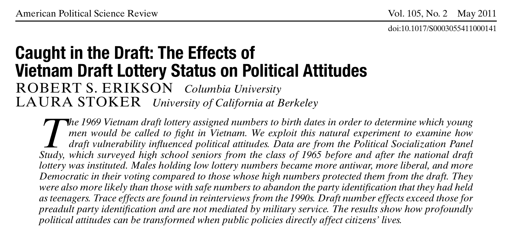
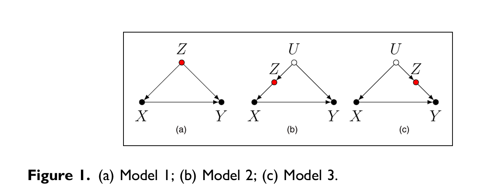
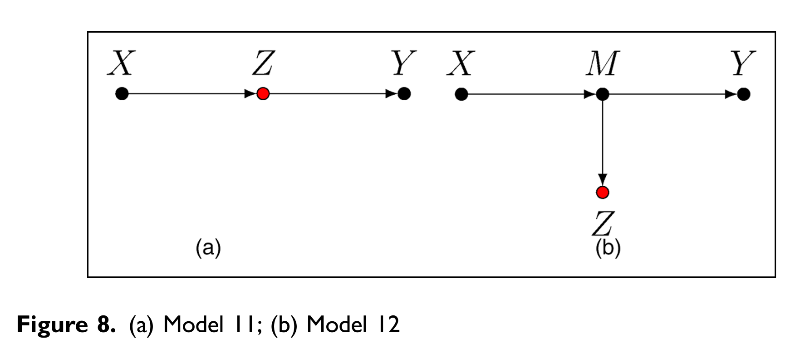
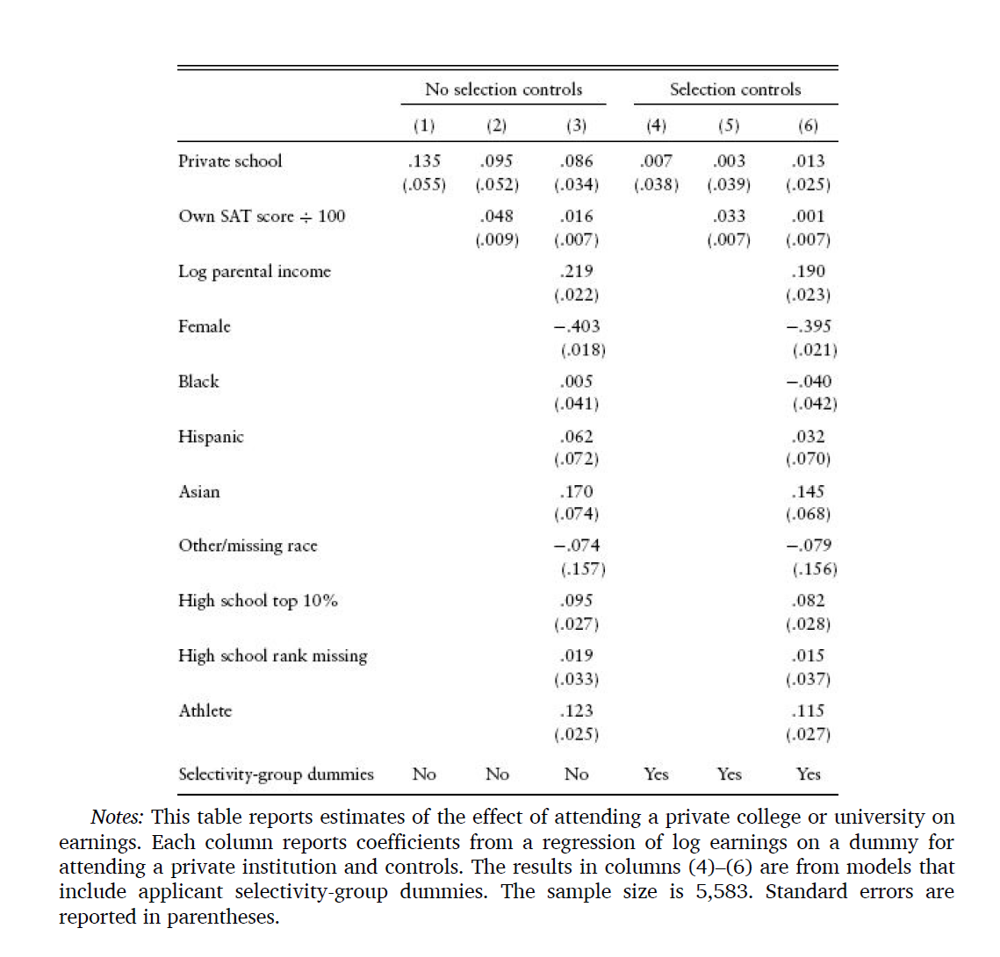
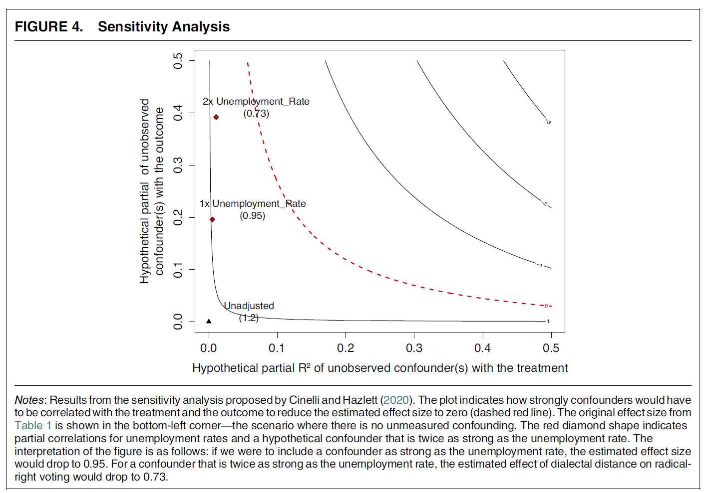

## Take-home exercises

 

{fig-align="center"}

. . .

 

**Take-home exercises II** already in **OLAT**

 

 

## Session 8 - Experimental studies

. . .

- Because of the **FPCI**, we focus on the **Average Treatment Effect (ATE)**

. . .

- However, **naïve comparisons** yield **biased estimates** due to **self-selection**  

. . .

- **Randomized experiments** are the *gold standard* because randomization removes **selection bias** in **large samples** (i.e., the *Law of Large Numbers*)

## 👥 Group activity session 8

 

In pairs, review each other’s exercise:  

1️⃣ Without randomization, would comparing your partner’s **treatment** and **control** groups' outcome values identify the **ATE**?  
  → Why or why not? 💭 Help each other fix any issues!

 

2️⃣ Check your partner's **confounders**, do they threaten **causal identification**?  
  → Can you suggest other potential confounders? 🧩

## The caveats of experiments

 

. . .

Experiments are the *gold standard* of causal inference but they have **limitations**

. . .

- Costly

- Unethical

- Unfeasible

. . .

In addition, while experiments excel in **internal validity**, they may have poor ***external validity***

## Experimental vs. observational data

 

**Experimental data:** The researcher *controls treatment assignment*, typically through ***randomization***

 

**Observational data:**  The researcher *does not control* who receives the treatment; **treatment assignment arises** ***endogenously***, typically by *self-selection*

. . .

→ However, **natural settings** typically allow better **external validity** and, in some cases, *might* be the **only option** available

## Causal inference with (large-N) observational data

 

. . .

Two ***approaches***:

. . .

  1. **Design-based inference** (e.g., natural experiments, quasi-experiments)

. . .

  2. **Statistical-based inference**

## Design-based inference

 

Exploiting **naturally** occurring **random or quasi-random assignment**

. . .

- **Lotteries** (e.g., Vietnam draft lottery)

- **Policy thresholds** (e.g., state funding only if a municipality exceeds a population cutoff)

- **Exogenous variation** (e.g., natural disasters)

---

{fig-align="center"}

## Statistical-based inference

 

When (quasi-)randomization is not possible, we can use **statistical methods** (e.g., regression) to artificially **hold covariates constant** (i.e., *ceteris paribus*)

. . .

 

We call this process ***control***: adding measures of **covariates** into our statistical model to remove selection bias 

. . .

However, *controlling for all other covariates* is ultimately *impossible*; therefore, ***we need to choose them carefully***

## Selecting good controls

 

. . .

1. Select variables that **confound** our relationship of interest

. . .

$$
 \text{In} \quad Z \longrightarrow X,\; Z \longrightarrow Y, \quad \text{Z  is a confounder}
$$

. . .

In this case, controlling for $Z$ is a good idea!

. . .

Controlling for $Z$ removes the part of the association between $X$ and $Y$ that is actually **due to** $Z$, giving us a cleaner estimate of the *ATE* of $X$

#

{width=60% fig-align="center"}

. . .

{width=45% fig-align="center"}

## Selecting good controls

 

1. Select variables that **confound** our relationship of interest

2. Select those confounders **closer** to $Y$, as long as they don't introduce bias (e.g., avoid colliders or mediators)

##

{width=45% fig-align="center"}

## Selecting good controls

 

1. Select variables that **confound** our relationship of interest

2. Select those confounders **closer** to $Y$, as long as they don't introduce bias (e.g., avoid colliders or mediators)

3. Collect **good measures** of the intended control variables  (see session 4)

. . .

4. Avoid **redundant controls** (e.g., political interest and political discussion)

## Omitted controls

 

Even after *careful modeling*, we may not convince everyone that we have controlled for **all relevant sources of bias**

. . .

→ **Omitted variable bias (OVB)** arises when an important factor is left out of the model, distorting the estimated ATE

. . .

Our specification must be guided by *theoretical reasoning*,  but we must always check the **robustness** of our results under **different assumptions** and **model specifications**

. . .

→ I.e., we must perform ***sensitivity analyses***

## 

{fig-align="center"}

## Types of observational data

. . .

Different data sources offer different possibilities for **statistical control**

. . .

- **Cross-sectional data:** many units at one point in time (use variation across units to control for time-invariant factors)

- **Longitudinal data:** one unit observed over time  (use within-unit changes to control for time-varying factors)

- **Panel data:** many units over time (combines both sources of variation; useful for causal inference but *never better than randomization*)

# Conclusion

## Causal inference with large-N observational data 

. . .

- **Design-based inference** exploits naturally random or quasi-random (i.e., exogenous) variation

. . .

- **Statistical-based inference** uses statistical models to artificially hold other factors constant (i.e., *ceteris paribus* condition)

. . .

- It requires solid **theoretical reasoning** (i.e., selecting **good controls**) and careful **sensitivity analyses**

## Your turn! Using DAGs to select control variables

 

. . .

{width=55% fig-align="center"}

## Next session (16:15)

 

*→ Small-N observational studies (and DAGs' exercise)*

 

. . .

**Before...**

 

Presentation by **Giulio Paraboni & Nikolina Djogova**:

*Wealth of tongues: Why peripheral regions vote for the radical right in Germany*

---

{fig-align="center"}

## Thanks! :slightly_smiling_face:

 

 

 

[alvaro.canalejo@unilu.ch](alvaro.canalejo@unilu.ch)
