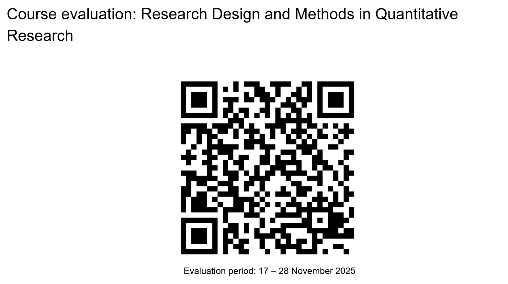
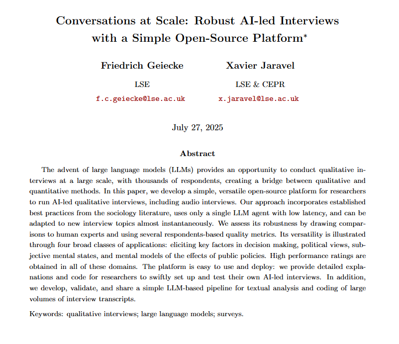
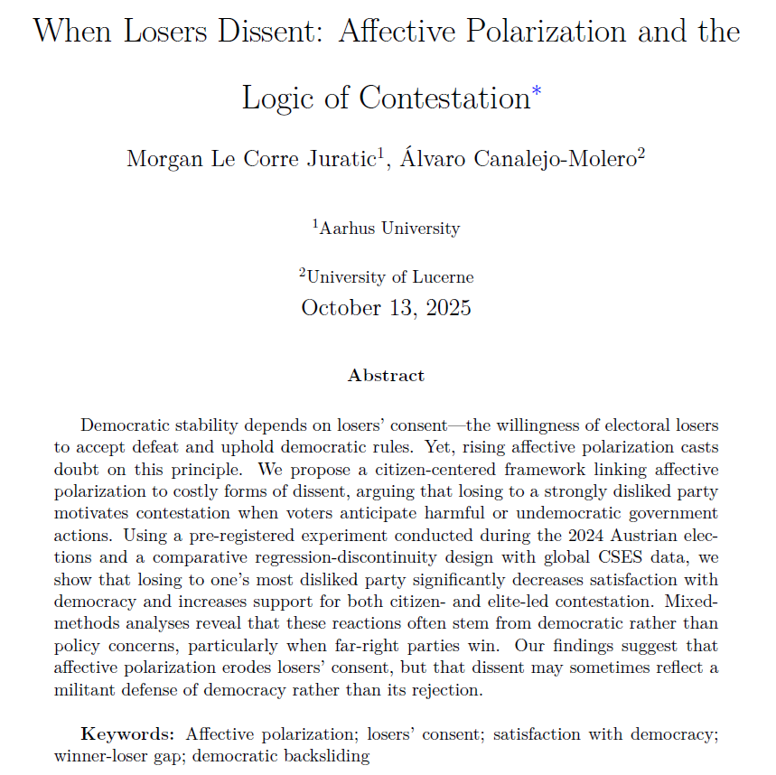
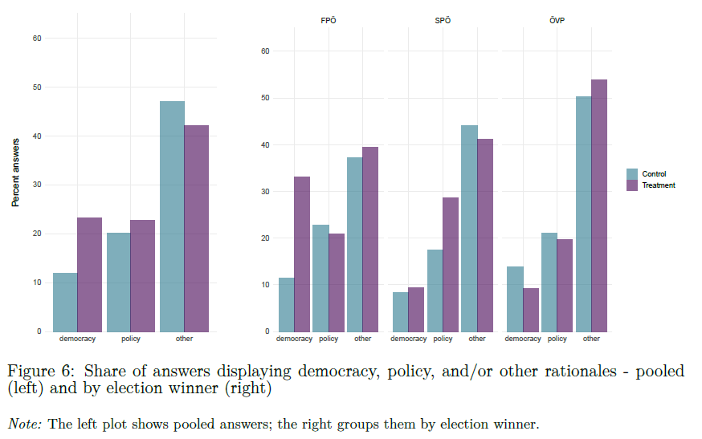
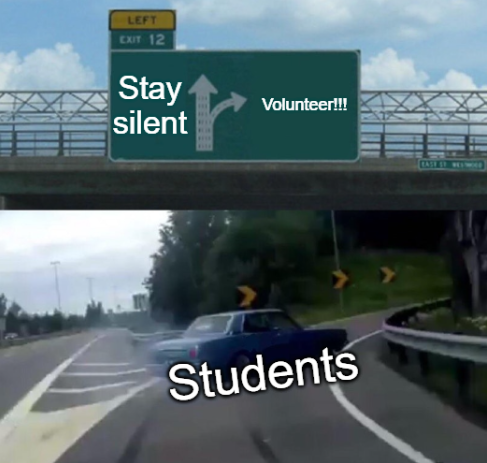

---

{fig-align="center"}

## Large vs small-N studies

 

. . .

**Large-N:** enough cases to estimate the desired statistical model (depending on the number of parameters) and to quantify uncertainty (depending on variation in the variables)  

→ Rule of thumb: $N ≳ 30$

 

. . .

**Small-N:** not enough cases to estimate the desired statistical model or quantify uncertainty  

→ Rule of thumb: $N ≲ 30$

## Small-N studies

 

. . .

They may be the only feasible option for **small-N processes** (e.g., revolutions) or when data are scarce

 

. . .

Additionally, they can provide a **qualitative understanding** of processes typically lacking in statistical analyses (e.g., meanings and interpretations)

## **This course** ***is not*** **about qualitative methods...**

 

 

. . .

**...but let's have a quick overview!**

## Small-N causal inference methods: cross-case analyses

 

- Method of difference (or *most different systems design*)

- Method of agreement (or *most similar systems design*)

- Method of concomitant variation

- Quantitative Qualitative Analysis (QCA): $N ≈ 20$

## Small-N causal inference methods: within-case analyses

 

- Pattern Matching

- **Process tracing**

- Causal narrative

## Interpretative methods

 

- Focus groups

- Semi-structured interviews

- Ethnography

- Discourse analysis

- Qualitative coding of open-ended questions

. . .

→ ...but there's ***not*** *always* a ***clear line***!

---

{fig-align="center"}

## Mixed-methods

 

. . .

Combines **quantitative** and **qualitative** approaches to strengthen inference:

- Quantitative methods identify patterns, estimate uncertainty and causal effects

- Qualitative methods clarify meanings and contextual factors, shedding light on mechanisms

. . .

Together, they can improve **validity**, **interpretation**, and **causal understanding**

---

{fig-align="center"}

---

{fig-align="center"}

# Conclusion

## Small-N analysis: a summary

. . .

 

- Sometimes the only *feasible option*

. . .

- The **key distinction** is that it **does not allow** the use of **statistical methods**, so quantification of associations, effects, and uncertainty is not feasible

. . .

- However, it can provide **qualitative information** that can be usefully coupled with quantitative analysis (i.e., ***mixed methods***) to improve inference

---

{fig-align="center"}

## Using DAGs to select control variables

 

1️⃣ ***Volunteer***

→ **Draw your DAG** on the board and **justify** your **control variable** choice

 

2️⃣ ***Class feedback***

→ Does the **DAG** correctly represent the assumed **causal structure**?  
→ Is the **proposed control variable** appropriate? Are there **alternative** controls or assumptions worth considering? 

## Next session (04.12.25 - 14:15)

 

*→ Statistical testing*

 

. . .

**Before...**

 

Presentation by **Anastasiia Lunkova & Bernhard Eymann**:

*Regulating Uber: The politics of the platform economy in Europe and the United States*

---

{fig-align="center"}

## Thanks! :slightly_smiling_face:

 

 

 

[alvaro.canalejo@unilu.ch](alvaro.canalejo@unilu.ch)
