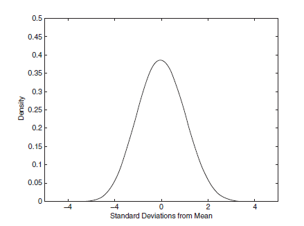
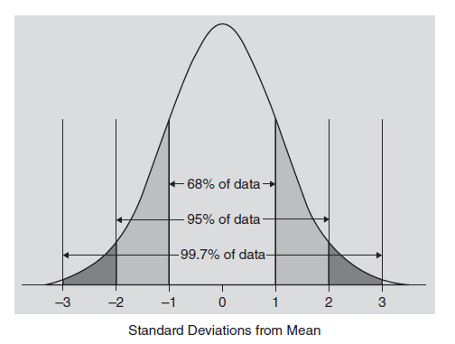
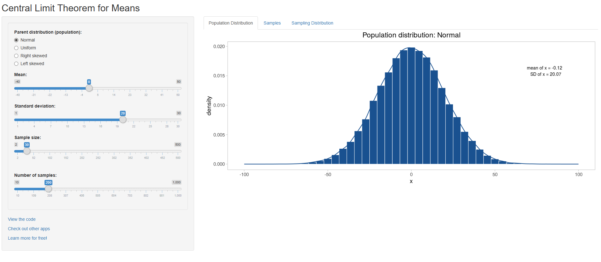
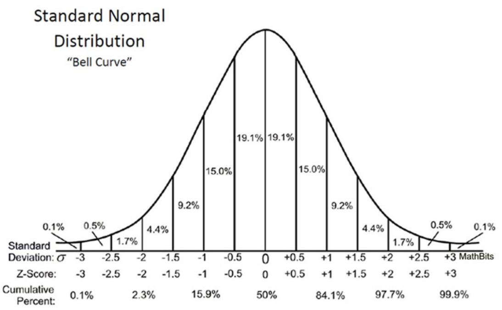
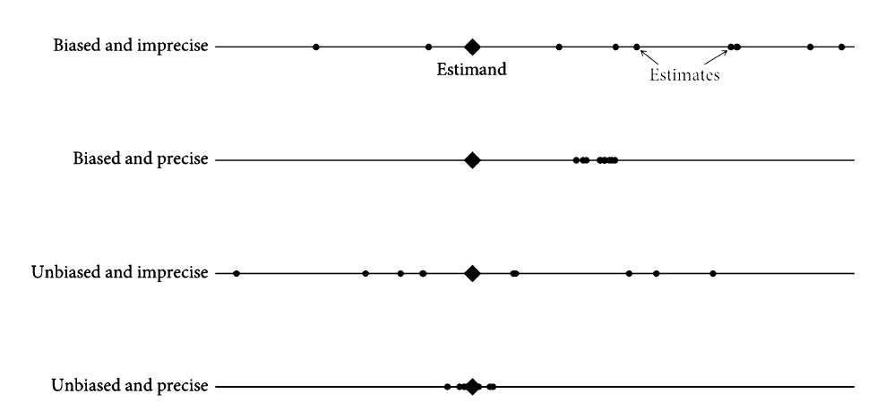

---

**Take-home exercises**

- THE 2 new deadline: Monday 8th

- THE 3 new deadline: Monday 22nd

. . .

Feedback?

. . .

**Course evaluations:** thanks!

. . .

  - Many topics, rush
  
  - Lecturer feedback
  
  - Duration, timing
  
  - THEs

## Research and Inference

 

> The goal of *good* research is to *“produce valid inferences about social and political life”* (King, Keohane, & Verba 1994, p. 3)

. . .

 

**Inference:** draw conclusions about the *population* from *sample* data

## Statistical Inference

 

Inferential goals:

- Descriptive 

- Causal 

- Predictive

. . .

 

We use probability and statistics to *formally* assess the **quality of our inferences**

## The Normal Distribution

::: columns
::: column

- Symmetric around the mean  
- Mean = median = mode  

- 1 SD ≈ 68% of area
- 2 SD ≈ 95%  of area
- 3 SD ≈ 99.7%  of area

$$ s = \sqrt{\frac{\sum (x - \bar{x})^2}{n-1}} $$

:::

::: column
{fig-align="center"}
:::
:::

## The Normal Distribution

{fig-align="center"}

## The Sampling Distribution

 

- Distribution of a statistic over **repeated (hypothetical) samples** 

- **Standard error:** $s$ of the sampling distribution

$SE = \frac{s}{\sqrt{n}}$

. . .

The **Central Limit Theorem (CLT)** says that the distribution of *sample statistics* (e.g., mean) approaches a *normal distribution* as sample size grows, ***regardless of the population shape***

---

[Live version](https://openintro.shinyapps.io/CLT_mean/)

## Confidence Intervals

 

- We can build **confidence intervals (CIs)** for 68%, 95%, or 99% *confidence levels* by choosing the correct **critical value**

. . .

- The **critical value** = number of *standard errors* needed to cover that *share of the sampling distribution *
  - 68% → 1.00  
  - 95% → 1.96  
  - 99% → 2.58  

## 95% CI for a sample mean

- Estimate: $\bar{x}$ 
- Standard error: $SE = \dfrac{s}{\sqrt{n}}$ 
- Critical value (approx.): $1.96$ 

- Formula (normal approximation):  $\bar{x} \;\pm\; 1.96 \cdot \frac{s}{\sqrt{n}}$

. . .

::: columns
::: column
Mean = 2  
$s$ = 0.5  
$n$ = 200
:::

::: column

$$ 2 \;\pm\; 1.96 \times \frac{0.5}{\sqrt{200}} $$
95% CI:  $(1.93,\; 2.07)$
:::
:::

## Bivariate hypothesis testing

 

*Same logic* (mean, SE, critical value) to **test if a difference between groups could be due to chance**

. . .

 
  
  - **Treatment group**: $\bar{y}$ = 2.3, $s$ = 0.6, $n$ = 100
  
  - **Control group**: $\bar{y}$ = 2.1, $s$ = 0.5, $n$ = 90

- **Null hypothesis:** the two population means are equal  
$$ H_0:\ \mu_T - \mu_C = 0 $$

## P-Values

 

A **p-value** is the *probability* of getting a result as extreme as ours **if the null hypothesis were true**  

. . .

1. We define the null hypothesis (i.e., no difference between groups)  

2. Calculate how far our observed difference is from that null 

3. Use a reference distribution (e.g., normal) to see how rare that result is  

## Difference in means example

 

1. Observed difference:  $\bar{y}_T - \bar{y}_C = 0.2$

. . .

2. Standard error:  $SE_{\text{diff}} = \sqrt{\frac{0.6^2}{100} + \frac{0.5^2}{90}} = \sqrt{0.0036 + 0.00278} \approx 0.080$

. . .

3. Test statistic (z-score):  $z =\frac{\bar{y}_T - \bar{y}_C}{SE_{\text{diff}}} = \frac{0.2}{0.080} \approx 2.5$

. . .

4. P-value (two-sided):  $p = 2 \cdot P(|Z| \ge |z|) = 2 \cdot P(|Z| \ge 2.50) \approx 0.025$

. . .

---

{fig-align="center"}

# Conclusion

## Summary

 

- With random sampling, the **CLT** gives sampling distributions that are approx. **normal** and **centered on the true population value**  
- Their spread is the **standard error**, which we use for inference:
  - **Confidence intervals**: estimate ± critical value × SE  
  - **P-value:** the probability of a result that extreme if the null were true  
  

## In Practice

 

***Statistical inference*** is the process through which we assess the *uncertainty* in our sample data  

 

It provides a way to **quantify the noise** in our estimates 

 

It relies on **assumptions** about the world (*probabilistic*) and data collection (*random sampling*) 

## Implications: bias vs. noise

{fig-align="center"}

## Next session (16:15)

 

*→ Introduction to Regression I*

 

. . .

**Before...**

 

Presentation by **Rojhat Yigit  & Elli Margaret Brown**:

*Without roots: The political consequences of collective economic shocks*

---

{fig-align="center"}

## Thanks! :slightly_smiling_face:

 

 

 

[alvaro.canalejo@unilu.ch](alvaro.canalejo@unilu.ch)
