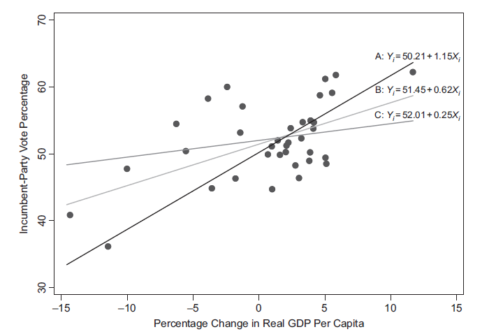
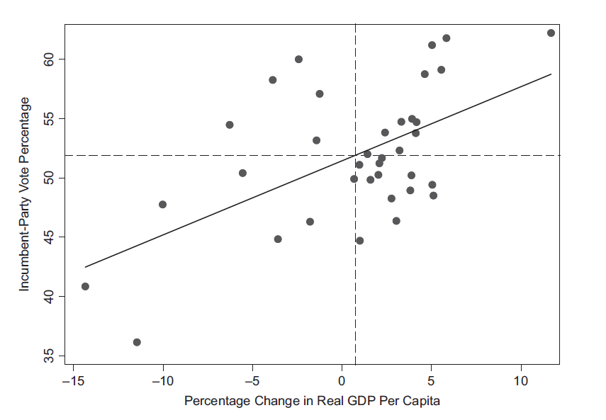
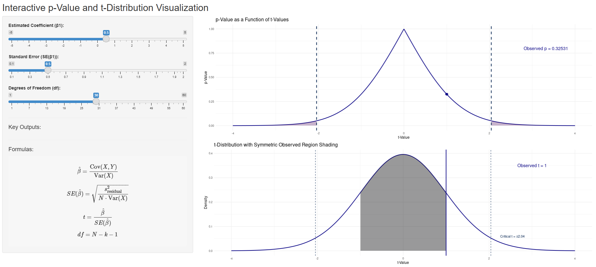

```{r}
#| echo: false

# Load libraries
library(dplyr)
library(stringr)

# Create dataset 
data <- tribble(
  ~Surname,         ~Name,
  "Brown",          "Elli Margaret",
  "Demir",          "Rojhat Yigit",
  "Djogova",        "Nikolina",
  "Eymann",         "Bernhard",
  "Flütsch",        "Reto",
  "Gaggini",        "Clelia",
  "Graf",           "Robin",
  "Hager",          "Lisa Anna",
  "Herrera Garcia", "Juan Manuel",
  "Hofer",          "Nadja Alexandra",
  "Klamt",          "Reachel",
  "Landis",         "Olivia Lea",
  "Lunkova",        "Anastasiia",
  "Michel",         "Fabian",
  "Moses",          "Emmanuel Saba",
  "Paraboni",       "Giulio",
  "Rios Quiroz",    "Laura",
  "Robatel",        "Annick France",
  "Schwegler",      "Salome Claudia"
)

# Combine Surname and Name into Full_Name
data <- data |>
  mutate(
    Full_Name = paste(Surname, Name),
    
    # Simple heuristic to infer gender
    Gender = case_when(
      Name %in% c("Bernhard", "Reto", "Robin", "Juan Manuel", "Fabian",
                  "Emmanuel Saba", "Giulio", "Rojhat Yigit") ~ "Male",
      TRUE ~ "Female"
    ),
    
    # Count number of words in full name
    Name_Length = str_length(str_remove_all(Full_Name, "\\s"))
  ) |>
  select(Full_Name, Gender, Name_Length)

# For random jitter reproducibility
set.seed(789)

# Add ChatGPT (v5) estimated ages
data <- data |>
  mutate(
    Age_Base = case_when(
      Full_Name == "Brown Elli Margaret" ~ 30,
      Full_Name == "Demir Rojhat Yigit" ~ 30,
      Full_Name == "Djogova Nikolina" ~ 30,
      Full_Name == "Eymann Bernhard" ~ 60,
      Full_Name == "Flütsch Reto" ~ 50,
      Full_Name == "Gaggini Clelia" ~ 40,
      Full_Name == "Graf Robin" ~ 30,
      Full_Name == "Hager Lisa Anna" ~ 30,
      Full_Name == "Herrera Garcia Juan Manuel" ~ 40,
      Full_Name == "Hofer Nadja Alexandra" ~ 40,
      Full_Name == "Klamt Reachel" ~ 30,
      Full_Name == "Landis Olivia Lea" ~ 20,
      Full_Name == "Lunkova Anastasiia" ~ 30,
      Full_Name == "Michel Fabian" ~ 30,
      Full_Name == "Moses Emmanuel Saba" ~ 40,
      Full_Name == "Paraboni Giulio" ~ 40,
      Full_Name == "Rios Quiroz Laura" ~ 30,
      Full_Name == "Robatel Annick France" ~ 60,
      Full_Name == "Schwegler Salome Claudia" ~ 30,
      TRUE ~ NA_real_
    ),
    # Add random variation between -3 and +3 years
    Age_Est = Age_Base + sample(-9:9, n(), replace = TRUE)
  )


```

## Covariance & correlation

. . .

<br>

<div style="font-size:80%; line-height:1.2;">


**Covariance:** measures how two variables vary together → direction

$$
\mathrm{Cov}(X, Y) = \frac{\sum_{i=1}^{n} (X_i - \bar{X})(Y_i - \bar{Y})}{n - 1}
$$

<br>

**Pearson Correlation Coefficient:** standardized covariance (–1 to 1) → direction and strength  

$$
r_{XY} = \frac{\mathrm{Cov}(X, Y)}{s_X \, s_Y}
$$

</div>

## Back to our classroom dataset!

::: {.panel-tabset}

### Data check

```{r}
#| echo: true
#| message: false
#| warning: false
#| code-line-numbers: "|1"
#| eval: false

# View first few rows of the new variable
head(data)
```

::: {.fragment}

```{r}
#| echo: false
#| message: false
#| warning: false
#| code-line-numbers: "|1"

# View first few rows of the new variable
head(data)
```

:::

### Prompt

"Infer the approximate age in 2025 for each person in this list of names based on European naming patterns, but add some random variation (±9 years) to make the estimates look more realistic."

### Justifications

<div style="font-size:70%; line-height:1.2;">

| Full Name | Est. Age | Reason |
|------------|-----------|--------|
| Elli Margaret Brown | 30 | Modern revival of Elli, 1990s–2000s |
| Rojhat Yigit Demir | 30 | Common among 1990s Turkish names |
| Nikolina Djogova | 30 | Popular in 1990s Balkans |
| Bernhard Eymann | 60 | Classic mid-20th-century name |
| Reto Flütsch | 50 | Typical Swiss 1970s–80s |
| Clelia Gaggini | 40 | Italian 1980s style |
| Robin Graf | 30 | 1990s unisex trend |
| Lisa Anna Hager | 30 | 1980s–90s peak |
| Juan Manuel Herrera Garcia | 40 | Spanish 1970s–80s double name |
| Nadja Alexandra Hofer | 40 | 1970s–80s Germanic pair |
| Reachel Klamt | 30 | 1990s variant of Rachel |
| Olivia Lea Landis | 20 | Olivia boom after 2000 |
| Anastasiia Lunkova | 30 | Eastern Europe 1990s |
| Fabian Michel | 30 | German 1980s–90s |
| Emmanuel Saba Moses | 40 | Stable 1970s–80s name |
| Giulio Paraboni | 40 | Italian 1970s–80s |
| Laura Rios Quiroz | 30 | 1980s–90s international peak |
| Annick France Robatel | 60 | French 1950s–60s |
| Salome Claudia Schwegler | 30 | Swiss revival 1980s–90s |

</div>

:::

## Covariance & correlation

::: {.fragment}


```{r}
#| echo: true
#| results: false
#| message: false
#| code-line-numbers: "|1"

# Covariance and correlation coefficient
cov(data$Name_Length, data$Age_Est, use = "complete.obs")
cor(data$Name_Length, data$Age_Est, use = "complete.obs")

```

:::

::: {.fragment}


```{r}
#| echo: false
#| results: hold
#| message: false

library(dplyr)

# Covariance and correlation coefficient
cov(data$Name_Length, data$Age_Est, use = "complete.obs")
cor(data$Name_Length, data$Age_Est, use = "complete.obs")

```

:::


## Introduction to Regression


. . .

<br>

Regression serves as a **statistical model** of reality

. . .

$$
Y = mX + b
$$

. . .

- Quantifies how changes in $X$ are associated with changes in $Y$

- It is *asymmetric*: $X$ is the predictor and $Y$ the outcome

- $m$ is the **slope**

## Bivariate Regression Model

<br>

$$
Y_i = \alpha + \beta X_i + \varepsilon_i
$$

. . .

- $\alpha$ is the intercept: expected value of $Y$ when $X = 0$

- $\varepsilon$ (or $u$) is the error term: all factors explaining $Y$ not captured by $X$, or **residual**

$$
\varepsilon_i
= Y_i - \hat{Y}_i = Y_i - \big( \hat{\alpha} + \hat{\beta} X_i \big) 
$$

## Fitting the Best Line

::: {.panel-tabset}

### Scatterplot

```{r}
#| echo: false
#| message: false
#| warning: false
#| eval: true

library(ggplot2)

ggplot(data, aes(x = Name_Length, y = Age_Est)) +
geom_point(size = 3, color = "black", alpha = 0.8) +
labs(
title = "Relationship Between Estimated Age and Name Length",
x = "Name Length (letters)",
y = "Estimated Age (years)"
) +
theme_minimal(base_size = 14)
```

### + line


```{r}
#| echo: false
#| message: false
#| warning: false
#| eval: true

library(ggplot2)

ggplot(data, aes(x = Name_Length, y = Age_Est)) +
  geom_point(size = 3, color = "black", alpha = 0.8) +
  geom_abline(
    intercept = coef(lm(Age_Est ~ Name_Length, data = data))[1],
    slope = coef(lm(Age_Est ~ Name_Length, data = data))[2],
    color = "gray40",
    linewidth = 1.1
  ) +
  labs(
    title = "Relationship Between Estimated Age and Name Length",
    x = "Name Length (letters)",
    y = "Estimated Age (years)"
  ) +
  theme_minimal(base_size = 14)
```

### + residuals

```{r}
#| echo: false
#| message: false
#| warning: false
#| eval: true

library(ggplot2)


# Fit regression model
m <- lm(Age_Est ~ Name_Length, data = data)

# Add fitted values to the dataset
data$resid_fitted <- predict(m)

ggplot(data, aes(x = Name_Length, y = Age_Est)) +
  # Dashed red residual lines
  geom_segment(aes(
    xend = Name_Length,
    yend = resid_fitted
  ),
  color = "red",
  linetype = "dashed",
  linewidth = 0.7
  ) +
  # Points
  geom_point(size = 3, color = "black", alpha = 0.8) +
  # Regression line
  geom_abline(
    intercept = coef(m)[1],
    slope = coef(m)[2],
    color = "gray40",
    linewidth = 1.1
  ) +
  labs(
    title = "Relationship Between Estimated Age and Name Length",
    x = "Name Length (letters)",
    y = "Estimated Age (years)"
  ) +
  theme_minimal(base_size = 14)
```

### Code

```{r}
#| echo: true
#| message: false
#| warning: false
#| eval: false

library(ggplot2)


# Scatterplot
ggplot(data, aes(x = Name_Length, y = Age_Est)) +
geom_point(size = 3, color = "black", alpha = 0.8) +
labs(
title = "Relationship Between Estimated Age and Name Length",
x = "Name Length (letters)",
y = "Estimated Age (years)"
) +
theme_minimal(base_size = 14)

# Scatterplot + line
ggplot(data, aes(x = Name_Length, y = Age_Est)) +
  geom_point(size = 3, color = "black", alpha = 0.8) +
  geom_abline(
    intercept = coef(lm(Age_Est ~ Name_Length, data = data))[1],
    slope = coef(lm(Age_Est ~ Name_Length, data = data))[2],
    color = "gray40",
    linewidth = 1.1
  ) +
  labs(
    title = "Relationship Between Estimated Age and Name Length",
    x = "Name Length (letters)",
    y = "Estimated Age (years)"
  ) +
  theme_minimal(base_size = 14)

# Fit regression model
m <- lm(Age_Est ~ Name_Length, data = data)

# Add fitted values to the dataset
data$resid_fitted <- predict(m)

ggplot(data, aes(x = Name_Length, y = Age_Est)) +
  # Dashed red residual lines
  geom_segment(aes(
    xend = Name_Length,
    yend = resid_fitted
  ),
  color = "red",
  linetype = "dashed",
  linewidth = 0.7
  ) +
  # Points
  geom_point(size = 3, color = "black", alpha = 0.8) +
  # Regression line
  geom_abline(
    intercept = coef(m)[1],
    slope = coef(m)[2],
    color = "gray40",
    linewidth = 1.1
  ) +
  labs(
    title = "Relationship Between Estimated Age and Name Length",
    x = "Name Length (letters)",
    y = "Estimated Age (years)"
  ) +
  theme_minimal(base_size = 14)
```

:::

---

{fig-align="center"}

## Ordinary Least-Squares (OLS)

<br>

. . .

$$
\hat{\beta}
= \frac{\sum_{i=1}^n (X_i - \bar{X})(Y_i - \bar{Y})}
       {\sum_{i=1}^n (X_i - \bar{X})^2}
$$

<br>

. . .

$$
\hat{\alpha}
= \bar{Y} - \hat{\beta}\,\bar{X}
$$

---

{fig-align="center"}


## Goodness of Fit

> Goodness of fit tells us how well the regression model’s predicted values $\hat Y_i$ match the observed values $Y_i$, that is, how much of the  variation in $Y$ the model explains

. . .

<div style="font-size:90%; line-height:1.2;">

**Total Sum of Squares (TSS)** $= \sum_{i=1}^n (Y_i - \bar{Y})^2$

**Residual Sum of Squares (RSS)**  $= \sum_{i=1}^n (Y_i - \hat{Y}_i)^2$

**Coefficient of Determination (R²)** $= 1 - \frac{\text{RSS}}{\text{TSS}}$
  
**Root Mean Squared Error (RMSE)** $= \sqrt{ \frac{1}{n} \sum_{i=1}^n (Y_i - \hat{Y}_i)^2 } = \sqrt{ \frac{\text{RSS}}{n} }$  
  
</div>

## Estimating Uncertainty

. . .

<br>

**Residual variance** (estimate of the error variance):  
$$
\hat{\sigma}^2
= \frac{
    \sum_{i=1}^n (Y_i - \hat{Y}_i)^2
  }{
    n - 2
  }
$$

**Standard error of the slope** (precision of $\beta$ estimates):  
$$
\operatorname{SE}(\hat\beta)
= \sqrt{
    \frac{\hat{\sigma}^2}
         {\sum_{i=1}^n (X_i - \bar{X})^2}
  }
$$


## CIs

<br>

Confidence intervals are **bounds** added to $\beta$, constructed with a *t-critical value* from the *sampling distribution* of its standardized form ($t_{\text{stat}} = \frac{\hat{\beta}}{SE(\hat{\beta})}$)

. . .

$$
\hat{\beta}\ \pm\ t_{\text{crit}} \cdot SE(\hat{\beta})
$$

where the t-critical value for 95% confidence is
$$
t_{\text{crit}} = t_{n-2,\,0.975} \approx 1.96
$$

## Adding Uncertainty

::: {.panel-tabset}

### Slope + CIs


```{r}
#| echo: false
#| message: false
#| warning: false
#| eval: true

library(ggplot2)

ggplot(data, aes(x = Name_Length, y = Age_Est)) +
  geom_point(size = 3, color = "black", alpha = 0.8) +

  # regression line + 95% CI
  geom_smooth(
    method = "lm",
    se = TRUE,
    color = "gray20",
    fill = "gray70",
    linewidth = 1,
    alpha = 0.3
  ) +

  labs(
    title = "Relationship Between Estimated Age and Name Length",
    x = "Name Length (letters)",
    y = "Estimated Age (years)"
  ) +
  theme_minimal(base_size = 14)
```


### Code

```{r}
#| echo: true
#| message: false
#| warning: false
#| eval: false

library(ggplot2)

ggplot(data, aes(x = Name_Length, y = Age_Est)) +
  geom_point(size = 3, color = "black", alpha = 0.8) +

  # regression line + 95% CI
  geom_smooth(
    method = "lm",
    se = TRUE,
    color = "gray20",
    fill = "gray70",
    linewidth = 1,
    alpha = 0.3
  ) +

  labs(
    title = "Relationship Between Estimated Age and Name Length",
    x = "Name Length (letters)",
    y = "Estimated Age (years)"
  ) +
  theme_minimal(base_size = 14)

```

### Explanation

For each value of $x$, ggplot computes the fitted value

$$
\hat{y}(x) = \hat{\alpha} + \hat{\beta}x.
$$

The standard error of this predicted mean is

$$
SE(\hat{y}(x)) =
\hat{\sigma}
\sqrt{
\frac{1}{n} +
\frac{(x - \bar{x})^2}{\sum (x_i - \bar{x})^2}
},
$$

with

$$
\hat{\sigma}^2 = \frac{\sum (y_i - \hat{y}_i)^2}{n - 2}.
$$

The 95% CI is then

$$
\hat{y}(x) \pm t_{n-2,0.975}\, SE(\hat{y}(x)).
$$

:::

## P-values

<br>

p-values use the *observed t-statistic* ($t_{\text{stat}} = \frac{\hat{\beta}}{SE(\hat{\beta})}$) and compare it to the **t-distribution under the assumption that the true $\beta$ equals 0**


. . .

<br>

Tests the null hypothesis:
$$
H_0:\ \beta = 0
$$

---



[Live version](https://acanalejo.shinyapps.io/12_session12/)

## Regressing Estimated Age on Name Length

::: {.fragment}


```{r}
#| echo: true
#| results: false
#| message: false
#| code-line-numbers: "|1"

# Regression model
m <- lm(Age_Est ~ Name_Length, data = data)
summary(m)

```

:::

::: {.fragment}


```{r}
#| echo: false
#| results: hold
#| message: false

library(dplyr)

# Regression model
m <- lm(Age_Est ~ Name_Length, data = data)
summary(m)
```

:::


## Interpreting the p-value of $\beta$

<br>

. . .

It tells us **how likely it would be to observe an estimated slope as large as ours** *if the true relationship between $X$ and $Y$* was actually **zero**:

$$
H_0: \beta = 0
$$

The p-value does *not* measure effect size, importance, or causality; it only reflects **evidence against**

$$
\beta = 0
$$

# Conclusion

## Bivariate Regression Summary

. . .

- Estimates how **changes in one variable relate to changes in another**

. . .

- **Slope** shows direction and strength of the relationship

. . .

- **Residuals** capture what the model does not explain 

. . .

- **Standard errors** reflect precision of the estimates 

  - Depend on the *association strength*, *variance of $X$*, and *$n$*

. . .

- **p-values** indicate whether the relationship differs from zero

---

{fig-align="center"}

## Next session (18.12.25 - 14:15)

<br>

*→ Introduction to Regression II*

<br>

. . .

**Before...**

<br>

Presentation by **Robin Graf**:

*Allies of the Weak: La Résistance and Jews in the Holocaust*

## Thanks! :slightly_smiling_face:

<br>

<br>

<br>

<center>[alvaro.canalejo@unilu.ch](alvaro.canalejo@unilu.ch)</center>