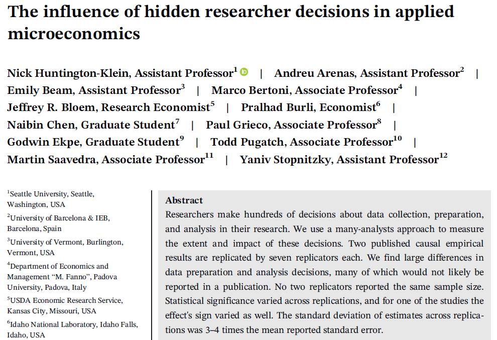
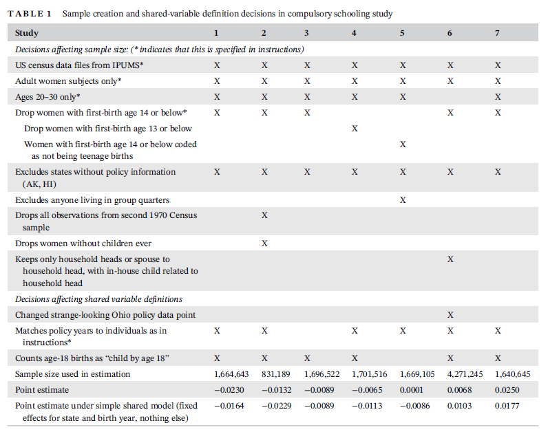
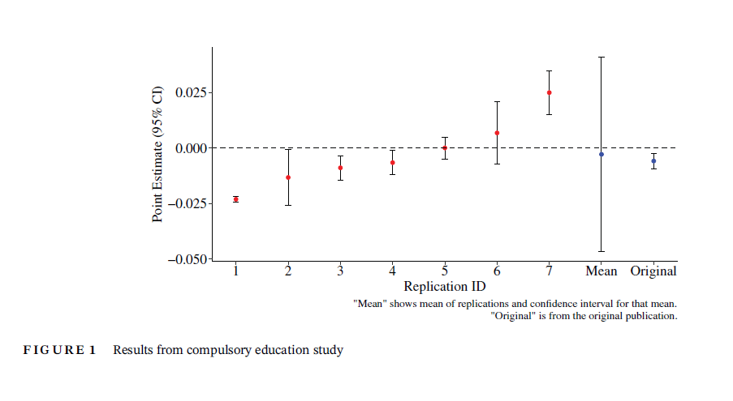
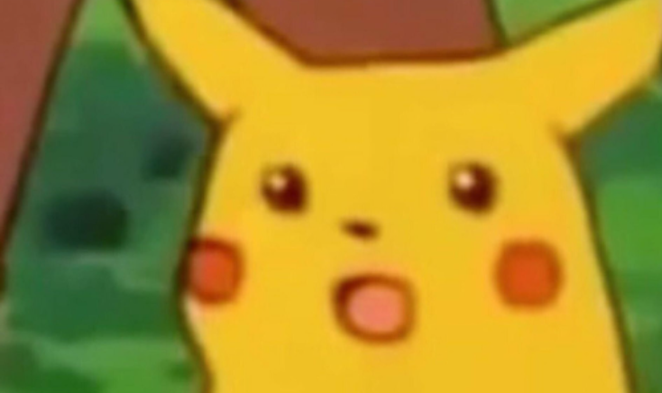

## Wrap-Up

 

. . .

| Session | Topic | Core focus |
|--|---------|---------------|
| 2 | **The logic of scientific research** | Defining research questions |
| 3 | **Theory and research design** | Deriving hypotheses from theory |
| 4 | **Data and measurement** | Validity and reliability of measures |
| 5 | **Descriptive inference** | Summarizing and describing data |
| 6 | **Causal inference** | Potential outcomes framework |
| 7 | **Predictive inference** | Prediction versus causality |
| 8 | **Experimental studies** | Randomization and average treatment effects |
| 9 | **Large-N observational studies** | Design/Regression-based causal inference |
|10 | **Small-N observational studies** | Mixed-method research designs |
|11 | **Statistical testing** | Sampling uncertainty and inference |
|12 | **Introduction to regression I** | Estimating coefficients and uncertainty |
|13 | **Introduction to regression II** | Statistical control and advanced topics overview |

---

{fig-align="center"}

---

{fig-align="center"}

---

{fig-align="center"}

## Methods are Just Tools!

. . .

- Your decisions must be **goal-oriented** and **theory-driven**

- Because **arbitrariness** exists, being **transparent** and **reproducible** is key

- **Sensitivity analyses** are crucial: different **assumptions**, different **measures**, different **models** — report everything

. . .

 

**Hopefully, research something that you like**

  - Research can be hard, but also **fulfilling** :)
  

---

{fig-align="center"}

# Final group activity

{fig-align="center"}

---

*Imagine you receive a 1,000,000 CHF SNF grant to answer the following question...*

. . .

**What is the effect of social media use on youths’ political engagement and behavior?**

. . .

Let's divide the class into ***three groups*** and prepare a research design to test **one (simple) hypothesis** of your choice to answer this question!

. . .

**Structure**

- **20 minutes** for internal group discussion  

- **Up to 5 minutes per group** to present the hypothesis and research design  
  *(one speaker)*  

- **Up to 5 minutes per group** to provide **constructive feedback** to the other groups  
  *(another speaker)*  
  
- **Q&A**

## Votation!

 

- Each student votes for the **best design other than their own**

- The design with the **most votes wins**

- In the event of a tie, the **lecturer casts the deciding vote**

. . .

{fig-align="center"}

## It's being an enormous pleasure! :slightly_smiling_face:

. . .

 

 

**Thank you all!**

 

[alvaro.canalejo@unilu.ch](alvaro.canalejo@unilu.ch)
